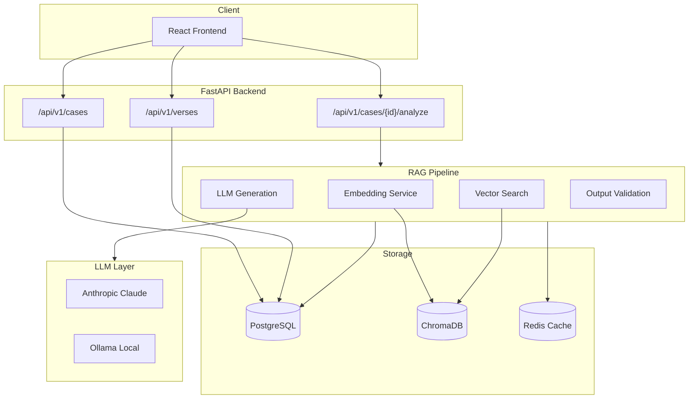
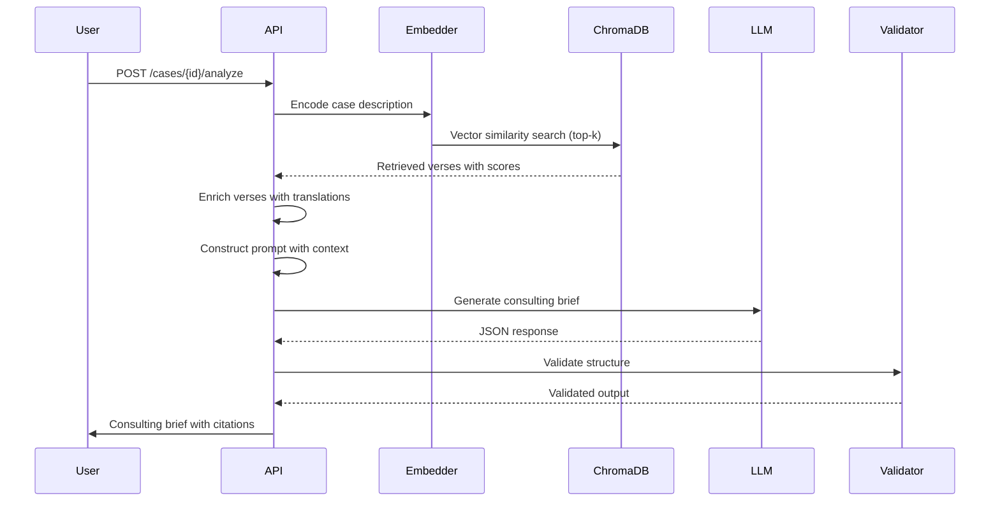
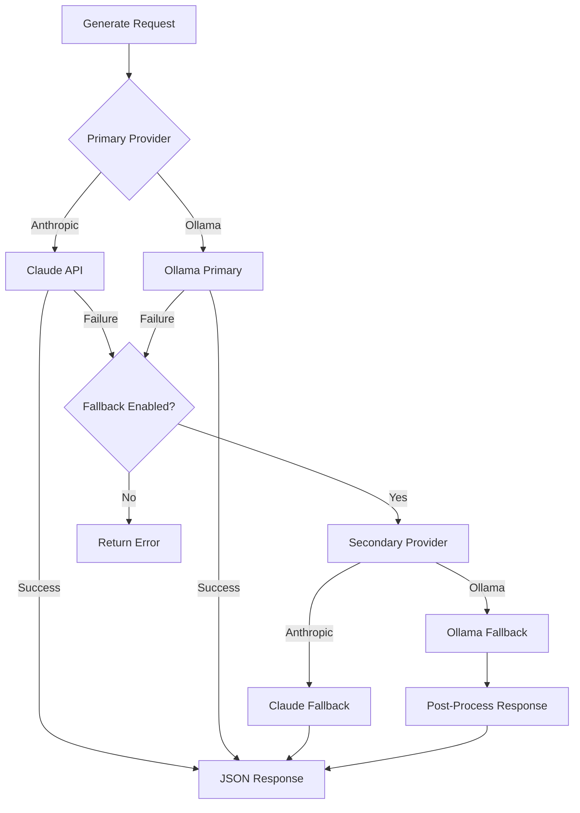
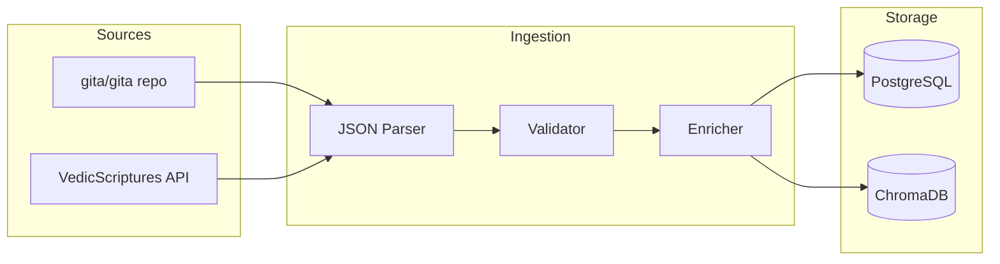

# Building Geetanjali: A RAG System for Ethical Decision Support

## The Problem

Leaders face ethical dilemmas without easy answers. Layoffs versus gradual restructuring. Whistleblowing versus internal resolution. Stakeholder conflicts where every choice carries moral weight.

Traditional decision frameworks (cost-benefit analysis, stakeholder mapping) help structure thinking but don't address the underlying ethical dimensions. Meanwhile, general-purpose LLMs can generate advice but without grounding in established wisdom traditions, their output tends toward generic platitudes.

Geetanjali addresses this gap: provide structured ethical guidance grounded in the Bhagavad Geeta's 701 verses, with explicit citations and confidence scores.

## Why RAG for Ethical Guidance

Retrieval-Augmented Generation solves two problems:

1. **Grounding** - Instead of hallucinating advice, the LLM receives relevant verses as context. Every recommendation traces back to specific scripture.

2. **Transparency** - Users see which verses informed the guidance. They can verify interpretations, explore further, or disagree.

A naive approach would fine-tune an LLM on Geeta content. RAG avoids this because:
- Scripture interpretation evolves; RAG allows updating the knowledge base without retraining
- Citations matter; RAG naturally preserves source attribution
- The corpus is small (701 verses); fine-tuning would likely overfit

## Architecture



### Component Responsibilities

| Component | Purpose |
|-----------|---------|
| PostgreSQL | Cases, users, outputs, verses with translations |
| ChromaDB | 384-dimensional verse embeddings for semantic search |
| Redis | Response caching, session storage, rate limiting |
| Anthropic Claude | Primary LLM for structured JSON generation |
| Ollama | Local fallback when Claude unavailable |

## The RAG Pipeline



### Step 1: Embedding

User case descriptions are embedded using `sentence-transformers/all-MiniLM-L6-v2`:

```python
# backend/services/embeddings.py
class EmbeddingService:
    def __init__(self):
        self.model = SentenceTransformer('sentence-transformers/all-MiniLM-L6-v2')

    def encode(self, texts: Union[str, List[str]]) -> List[float]:
        return self.model.encode(texts, normalize_embeddings=True).tolist()
```

Why MiniLM-L6-v2:
- 384 dimensions (compact)
- Fast inference (~14ms per sentence)
- Strong performance on semantic similarity benchmarks
- Runs locally without API calls

### Step 2: Retrieval

ChromaDB finds semantically similar verses:

```python
# backend/services/vector_store.py
def search(self, query: str, top_k: int = 5) -> Dict[str, Any]:
    query_embedding = self.embedding_service.encode(query)

    results = self.collection.query(
        query_embeddings=[query_embedding],
        n_results=top_k
    )

    return {
        "ids": results["ids"][0],
        "distances": results["distances"][0],
        "documents": results["documents"][0],
        "metadatas": results["metadatas"][0]
    }
```

Each verse is stored with metadata:
- `canonical_id`: BG_{chapter}_{verse} (e.g., BG_2_47)
- `paraphrase`: Modern English interpretation
- `principles`: Extracted ethical principles
- `themes`: Categorization tags

### Step 3: Context Construction

Retrieved verses are formatted into a structured prompt:

```python
# backend/services/prompts.py
def build_user_prompt(case_data: Dict, retrieved_verses: List[Dict]) -> str:
    prompt_parts = [
        "# Ethical Dilemma Case\n",
        f"**Title:** {case_data.get('title')}\n",
        f"**Role:** {case_data.get('role')}\n",
        f"**Description:** {case_data.get('description')}\n",
    ]

    prompt_parts.append("\n# Relevant Bhagavad Geeta Verses\n")
    for verse in retrieved_verses:
        canonical_id = verse['metadata']['canonical_id']
        paraphrase = verse['metadata']['paraphrase']
        prompt_parts.append(f"**{canonical_id}**: {paraphrase}\n")

    return "".join(prompt_parts)
```

### Step 4: LLM Generation

The LLM receives the constructed prompt with a system message defining the expected JSON output:

```python
# backend/services/rag.py
def generate_brief(self, prompt: str, retrieved_verses: List[Dict]) -> Dict:
    result = self.llm_service.generate(
        prompt=prompt,
        system_prompt=SYSTEM_PROMPT,
        temperature=0.7,
        fallback_prompt=build_ollama_prompt(case_data, retrieved_verses),
        fallback_system=OLLAMA_SYSTEM_PROMPT
    )

    return json.loads(result["response"])
```

The system prompt enforces structure:

```json
{
  "executive_summary": "...",
  "options": [
    {
      "title": "Option 1",
      "description": "...",
      "pros": ["..."],
      "cons": ["..."],
      "sources": ["BG_2_47"]
    }
  ],
  "recommended_action": {
    "option": 1,
    "steps": ["..."],
    "sources": ["BG_18_63"]
  },
  "reflection_prompts": ["..."],
  "sources": [
    {
      "canonical_id": "BG_2_47",
      "paraphrase": "Act focused on duty, not fruits.",
      "relevance": 0.95
    }
  ],
  "confidence": 0.85,
  "scholar_flag": false
}
```

### Step 5: Validation and Fallback

Output validation ensures completeness and flags low-confidence responses:

```python
# backend/services/rag.py
def validate_output(self, output: Dict) -> Dict:
    required_fields = [
        "executive_summary", "options", "recommended_action",
        "reflection_prompts", "sources", "confidence"
    ]

    for field in required_fields:
        if field not in output:
            output[field] = [] if field != "confidence" else 0.5

    if output["confidence"] < settings.RAG_SCHOLAR_REVIEW_THRESHOLD:
        output["scholar_flag"] = True

    return output
```

## LLM Provider Strategy



### Why Hybrid LLM

1. **Anthropic Claude** (Primary)
   - High-quality structured output
   - Reliable JSON generation
   - Fast response times

2. **Ollama** (Fallback)
   - Runs locally, no API costs
   - Works offline
   - Simplified prompt for faster inference

The fallback uses a simplified prompt optimized for smaller models:

```python
OLLAMA_SYSTEM_PROMPT = """You are an ethical leadership consultant.
Output JSON with: executive_summary, options (2), recommended_action,
reflection_prompts (2), sources, confidence, scholar_flag.
Use verse IDs like BG_2_47. Output ONLY valid JSON."""
```

## Data Pipeline



### Verse Data Structure

```json
{
  "canonical_id": "BG_2_47",
  "chapter": 2,
  "verse": 47,
  "sanskrit_devanagari": "कर्मण्येवाधिकारस्ते...",
  "sanskrit_iast": "karmaṇy-evādhikāras te...",
  "translations": [
    {
      "author": "Swami Sivananda",
      "text": "Your right is to work only..."
    }
  ],
  "paraphrase": "Act focused on duty, not fruits.",
  "principles": ["detachment", "duty", "action"]
}
```

### Embedding Strategy

Each verse is embedded as concatenated text:
- Sanskrit IAST transliteration
- Primary English translation
- Modern paraphrase

This captures both the original language's semantic content and accessible interpretation.

## Key Design Decisions

### 1. Structured Output Over Free Text

The system outputs JSON with explicit fields rather than prose. This enables:
- Programmatic consumption (API clients, integrations)
- Consistent UI rendering
- Validation and quality checks

### 2. Confidence Scoring

Every output includes a confidence score. Low confidence triggers:
- `scholar_flag: true` for human review
- Warning in UI
- Logging for quality analysis

### 3. Session-Based Anonymous Access

Anonymous users can create cases using session IDs:

```python
@router.post("", response_model=CaseResponse)
async def create_case(
    case_data: CaseCreate,
    current_user: Optional[User] = Depends(get_optional_user),
    session_id: Optional[str] = Depends(get_session_id)
):
    case_dict["user_id"] = current_user.id if current_user else None
    case_dict["session_id"] = session_id
```

This lowers friction for first-time users while allowing authenticated users to build persistent history.

### 4. Graceful Degradation

The pipeline never fails completely:

```python
def run(self, case_data: Dict, top_k: int = None) -> Dict:
    # Step 1: Try verse retrieval
    try:
        retrieved_verses = self.retrieve_verses(query, top_k)
    except Exception:
        retrieved_verses = []  # Continue without verses

    # Step 2: Try LLM generation
    try:
        output = self.generate_brief(prompt, ...)
    except Exception:
        return self._create_fallback_response(case_data, "LLM unavailable")

    # Step 3: Validate (with defaults for missing fields)
    return self.validate_output(output)
```

## Usage Example

### API Request

```bash
curl -X POST http://localhost:8000/api/v1/cases \
  -H "Content-Type: application/json" \
  -d '{
    "title": "Whistleblowing dilemma",
    "description": "I discovered financial irregularities at my company.
                    Reporting internally has failed. Do I go public?",
    "role": "Senior Manager",
    "stakeholders": ["employees", "shareholders", "regulators"],
    "constraints": ["NDA", "career risk"]
  }'
```

### API Response (Simplified)

```json
{
  "executive_summary": "This case presents a classic tension between
                        loyalty and truth-telling...",
  "options": [
    {
      "title": "Internal Escalation",
      "description": "Escalate to board audit committee...",
      "sources": ["BG_18_63"]
    },
    {
      "title": "External Disclosure",
      "description": "Report to regulators...",
      "sources": ["BG_2_47"]
    },
    {
      "title": "Document and Wait",
      "description": "Preserve evidence, continue internal advocacy...",
      "sources": ["BG_3_19"]
    }
  ],
  "recommended_action": {
    "option": 1,
    "steps": [
      "Request audit committee meeting",
      "Present documented evidence",
      "Set timeline for response"
    ]
  },
  "sources": [
    {
      "canonical_id": "BG_18_63",
      "paraphrase": "Choose with knowledge and freedom after reflection.",
      "relevance": 0.92
    }
  ],
  "confidence": 0.84
}
```

## When to Use Geetanjali

**Good fit:**
- Leadership ethical dilemmas requiring structured analysis
- Situations where traditional wisdom provides perspective
- Decisions benefiting from multiple options with tradeoffs
- Cases where citation and transparency matter

**Not a good fit:**
- Legal or medical decisions (requires professional advice)
- Situations requiring real-time or emergency response
- Contexts where Bhagavad Geeta framework doesn't apply

## Performance Characteristics

| Operation | Latency |
|-----------|---------|
| Embedding (per query) | ~15ms |
| Vector search (top-5) | ~25ms |
| LLM generation (Claude) | 2-4s |
| LLM generation (Ollama fallback) | 8-15s |
| Total pipeline | 3-5s typical |

## Conclusion

Geetanjali demonstrates that RAG can bring ancient wisdom into modern decision support. The key is treating scripture not as training data but as retrievable context, preserving attribution and enabling verification.

The architecture patterns here (hybrid LLM, graceful degradation, confidence scoring) apply broadly to any domain-specific RAG system where grounding and transparency matter.

---

*Geetanjali is open source under MIT license. Contributions welcome.*
