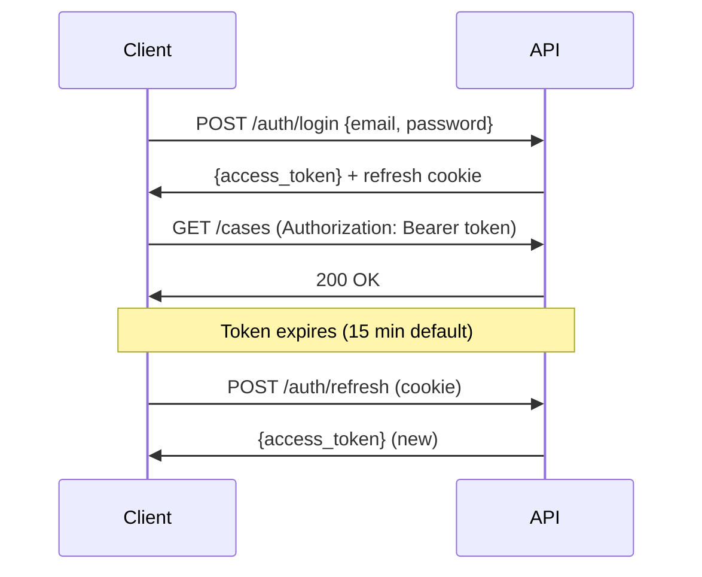
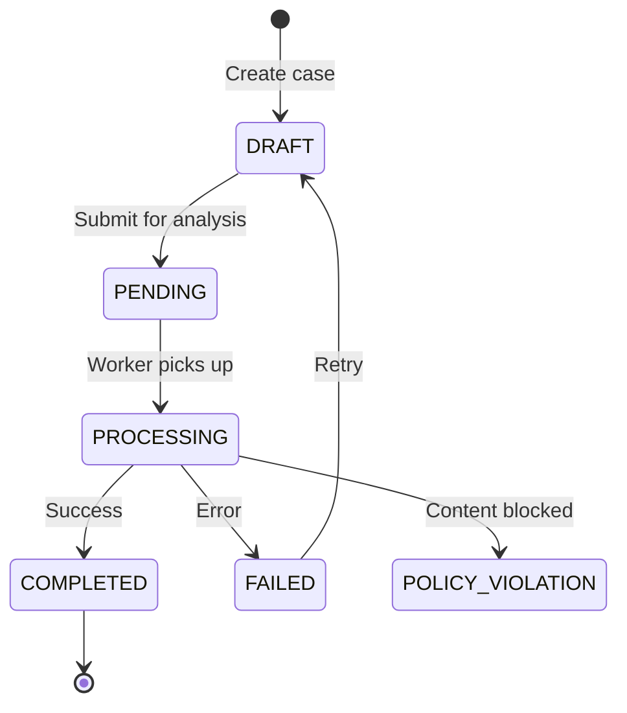

# API Reference

RESTful API at `/api/v1/`. Full OpenAPI docs at `/docs` when running.

## Authentication



**Token Types:**
- **Access Token:** Short-lived JWT (15 min), sent in `Authorization: Bearer` header
- **Refresh Token:** Long-lived (90 days), stored in HTTP-only cookie

**Anonymous Access:**
- Cases, verses, search work without authentication
- User-specific features (history, favorites) require login

**Admin Access:**
- `/admin/*` endpoints require `X-API-Key` header

---

## Rate Limits

| Endpoint | Limit | Scope |
|----------|-------|-------|
| Case analysis | 10/hour | Per user/IP |
| Follow-up questions | 30/hour | Per user/IP |
| General API | 100/hour | Per user/IP |

Response headers include `X-RateLimit-*` when approaching limits.

---

## Endpoints

### Authentication

| Method | Path | Description |
|--------|------|-------------|
| POST | `/auth/signup` | Create account |
| POST | `/auth/login` | Login, get tokens |
| POST | `/auth/refresh` | Refresh access token |
| POST | `/auth/logout` | Invalidate refresh token |
| POST | `/auth/forgot-password` | Request reset email |
| POST | `/auth/reset-password` | Reset with token |
| GET | `/auth/me` | Get current user |
| DELETE | `/auth/account` | Delete account |
| POST | `/auth/verify-email/{token}` | Verify email address |
| POST | `/auth/resend-verification` | Resend verification email |

**Signup Example:**
```bash
curl -X POST http://localhost:8000/api/v1/auth/signup \
  -H "Content-Type: application/json" \
  -d '{"email": "user@example.com", "password": "securepass123", "name": "User"}'
```

### Cases

| Method | Path | Description |
|--------|------|-------------|
| GET | `/cases` | List user's cases |
| POST | `/cases` | Create new case |
| GET | `/cases/{id}` | Get case details |
| PATCH | `/cases/{id}` | Update case |
| DELETE | `/cases/{id}` | Delete case |
| POST | `/cases/{id}/analyze/async` | Start analysis (async) |
| POST | `/cases/{id}/follow-up` | Ask follow-up question |

**Create Case:**
```bash
curl -X POST http://localhost:8000/api/v1/cases \
  -H "Content-Type: application/json" \
  -d '{
    "title": "Layoff Decision",
    "description": "Should I lay off 20% of staff to save the company?"
  }'
```

**Analyze Case (Async):**
```bash
# Start analysis - returns 202 Accepted
curl -X POST http://localhost:8000/api/v1/cases/{id}/analyze/async

# Poll for completion
curl http://localhost:8000/api/v1/cases/{id}
# status: "completed" when done
```



### Verses

| Method | Path | Description |
|--------|------|-------------|
| GET | `/verses` | List verses (paginated) |
| GET | `/verses/{ref}` | Get single verse (e.g., BG_2_47) |
| GET | `/verses/daily` | Today's verse |
| GET | `/verses/random` | Random verse |
| GET | `/verses/count` | Total verse count |
| GET | `/verses/batch` | Batch get verses by IDs |

**Query Parameters:**
- `chapter`: Filter by chapter (1-18)
- `featured`: Only featured verses
- `skip`, `limit`: Pagination

**Get Verse:**
```bash
curl http://localhost:8000/api/v1/verses/BG_2_47
```

### Search

| Method | Path | Description |
|--------|------|-------------|
| GET | `/search` | Search verses |
| GET | `/search/principles` | List searchable principles |

**Search Parameters:**
- `q`: Query text (required)
- `chapter`: Filter by chapter
- `principle`: Filter by principle category
- `limit`: Results per page (default 20)

```bash
curl "http://localhost:8000/api/v1/search?q=karma&chapter=2"
```

### Outputs

| Method | Path | Description |
|--------|------|-------------|
| GET | `/outputs/{id}` | Get analysis output |
| POST | `/outputs/{id}/feedback` | Submit feedback |
| GET | `/outputs/{id}/export/{format}` | Export (pdf, md, json) |

### Messages

| Method | Path | Description |
|--------|------|-------------|
| GET | `/cases/{id}/messages` | Get conversation history |

### Newsletter

| Method | Path | Description |
|--------|------|-------------|
| POST | `/newsletter/subscribe` | Subscribe to daily verse |
| POST | `/newsletter/verify/{token}` | Verify subscription |
| POST | `/newsletter/unsubscribe` | Unsubscribe |
| GET | `/newsletter/preferences` | Get preferences |
| PUT | `/newsletter/preferences` | Update preferences |

### User Preferences

| Method | Path | Description |
|--------|------|-------------|
| GET | `/preferences` | Get reading progress, favorites, settings |
| PUT | `/preferences` | Update preferences |
| POST | `/preferences/merge` | Merge local and server preferences |

### Reading Metadata

| Method | Path | Description |
|--------|------|-------------|
| GET | `/reading/book` | Get book metadata |
| GET | `/reading/chapters` | Get all chapter metadata |
| GET | `/reading/chapters/{n}` | Get specific chapter metadata |

### Admin (Requires X-API-Key)

| Method | Path | Description |
|--------|------|-------------|
| GET | `/admin/status` | System health status |
| POST | `/admin/ingest` | Trigger data ingestion |
| POST | `/admin/sync-featured` | Sync featured cases |
| POST | `/admin/enrich` | Enrich verse metadata |

```bash
curl -H "X-API-Key: your-api-key" \
  http://localhost:8000/api/v1/admin/status
```

### Public Endpoints

| Method | Path | Description |
|--------|------|-------------|
| GET | `/health` | Health check |
| GET | `/sitemap.xml` | XML sitemap |
| GET | `/feed.xml` | RSS feed |
| POST | `/contact` | Contact form |

---

## Response Format

**Success:**
```json
{
  "id": "uuid",
  "title": "Case Title",
  "status": "completed",
  "created_at": "2024-01-15T10:30:00Z"
}
```

**Error:**
```json
{
  "detail": "Case not found"
}
```

**Paginated:**
```json
{
  "items": [...],
  "total": 100,
  "skip": 0,
  "limit": 20
}
```

---

## Webhooks

Currently no webhooks. Use polling for async operations:

1. POST `/cases/{id}/analyze/async` → 202 Accepted
2. Poll GET `/cases/{id}` until `status` is `completed` or `failed`

---

## See Also

- [Architecture](architecture.md) — System design and data flow
- [Reference](reference.md) — Environment variables and error codes
- OpenAPI docs at `/docs` when running
