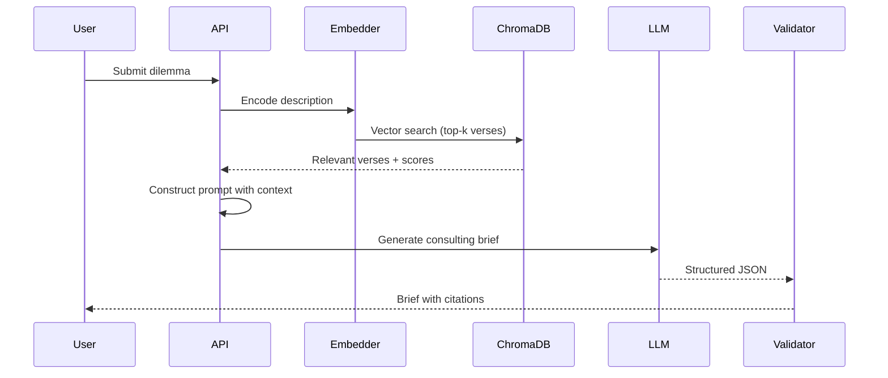
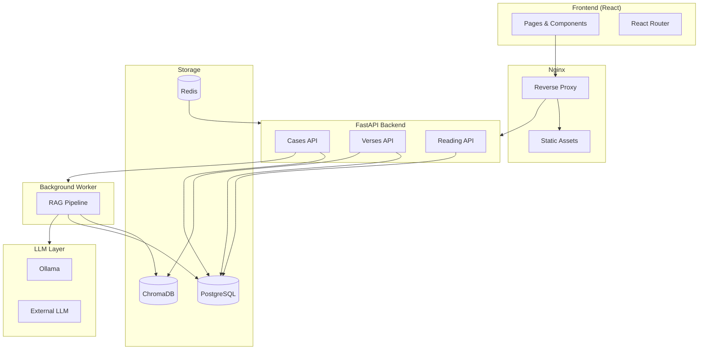

# Building Geetanjali

Geetanjali is a web app that makes the Bhagavad Geeta useful for modern life. It does two things: helps you think through ethical dilemmas, and lets you explore the scripture at your own pace.

Built with a **local-first, mobile-first** approach—runs entirely self-hosted, works offline, and feels native on phones.

## Two Journeys

```
┌─────────────────────────────────────────────────────────────────┐
│                         GEETANJALI                              │
├────────────────────────────┬────────────────────────────────────┤
│     CONSULTATION           │          DISCOVERY                 │
│     JOURNEY                │          JOURNEY                   │
├────────────────────────────┼────────────────────────────────────┤
│                            │                                    │
│  "I face a dilemma"        │  "I want to learn"                 │
│         ↓                  │         ↓                          │
│  Describe situation        │  Browse 701 verses                 │
│         ↓                  │         ↓                          │
│  RAG retrieves relevant    │  Filter by chapter, topic          │
│  verses from 701           │         ↓                          │
│         ↓                  │  Read sequentially or              │
│  LLM generates structured  │  explore by interest               │
│  guidance with citations   │         ↓                          │
│         ↓                  │  Sanskrit text, translations,      │
│  Three options with        │  leadership insights               │
│  pros, cons, verse refs    │                                    │
│                            │                                    │
├────────────────────────────┼────────────────────────────────────┤
│  Output: Consulting brief  │  Output: Scripture comprehension   │
│  with confidence score     │  with personal reading progress    │
└────────────────────────────┴────────────────────────────────────┘
```

| Journey | User Intent | Experience |
|---------|-------------|------------|
| **Consultation** | "Help me decide" | RAG-powered analysis with cited verses |
| **Discovery** | "Help me learn" | Browse, filter, read at your pace |

Both journeys use the same data: 701 verses across 18 chapters, with Sanskrit text, transliterations, multiple translations, and modern paraphrases.

---

## Consultation Journey

Leaders face ethical dilemmas without easy answers. Layoffs versus gradual restructuring. Whistleblowing versus internal resolution. Stakeholder conflicts where every choice has moral weight.

Regular LLMs can give advice, but without grounding in real wisdom, you get vague feel-good responses. Geetanjali uses RAG (Retrieval-Augmented Generation) to tie every recommendation back to specific verses from the Bhagavad Geeta.

### Why RAG

1. **Grounding** — The LLM gets relevant verses as context. Every recommendation traces back to scripture.
2. **Transparency** — You see which verses informed the guidance. You can verify, dig deeper, or disagree.
3. **Updatable** — Interpretations evolve. The knowledge base updates without retraining the model.

### The Pipeline



**Step by step:**

1. **Embed** — Case description encoded using `all-MiniLM-L6-v2` (~14ms, runs locally)
2. **Retrieve** — ChromaDB finds similar verses (cosine similarity, top-5)
3. **Construct** — Prompt combines user's dilemma with retrieved verses and their paraphrases
4. **Generate** — LLM produces structured output: summary, three options, recommendation, reflection prompts
5. **Validate** — Check for completeness. Low-confidence cases get flagged for review.

### Output Structure

```json
{
  "executive_summary": "This case presents a tension between loyalty and truth-telling...",
  "options": [
    {
      "title": "Internal Escalation",
      "pros": ["Preserves relationships", "Allows correction"],
      "cons": ["May be ignored", "Delays resolution"],
      "sources": ["BG_18_63"]
    }
  ],
  "recommended_action": {
    "option": 1,
    "reasoning": "Aligns with dharmic principle of giving others opportunity to correct...",
    "steps": ["Request audit committee meeting", "Present evidence", "Set timeline"]
  },
  "reflection_prompts": [
    "What outcome would you regret most?",
    "Who else is affected by inaction?"
  ],
  "sources": [
    {"canonical_id": "BG_18_63", "relevance": 0.92}
  ],
  "confidence": 0.84,
  "scholar_review_flag": false
}
```

Each option includes verse citations. Users can click through to read the full verse with translations.

### When It Fits

**Good fit:**
- Leadership dilemmas needing structured analysis
- Situations where traditional wisdom adds perspective
- Decisions that benefit from seeing multiple options with tradeoffs

**Not a good fit:**
- Legal or medical decisions (get professional advice)
- Emergencies needing immediate action
- Contexts where the Bhagavad Geeta framework doesn't make sense

---

## Discovery Journey

Not everyone shows up with a dilemma. Many want to learn, reflect, or just browse. The Discovery Journey handles this through two modes.

### Verse Browser

Grid-based exploration for research and discovery.

```
┌──────────────────────────────────────────────────────────────┐
│  [Featured] [All]    [Chapter ▼]    [Topic Pills...]         │
├──────────────────────────────────────────────────────────────┤
│                                                              │
│   ┌─────────────┐   ┌─────────────┐   ┌─────────────┐        │
│   │ ★ 2.47      │   │   3.19      │   │ ★ 2.48      │        │
│   │  Sanskrit   │   │  Sanskrit   │   │  Sanskrit   │        │
│   │ Translation │   │ Translation │   │ Translation │        │
│   │ [tag] [tag] │   │ [tag] [tag] │   │ [tag] [tag] │        │
│   └─────────────┘   └─────────────┘   └─────────────┘        │
│                                                              │
└──────────────────────────────────────────────────────────────┘
```

- **Featured/All toggle** — Curated highlights or all 701 verses
- **Chapter filter** — 18 chapters in a grid selector
- **Topic pills** — Filter by principle (karma yoga, detachment, duty)
- **Clickable tags** — Quick filtering from any card
- **Responsive grid** — 1-4 columns depending on screen size

### Verse Detail

One verse, full context.

```
┌──────────────────────────────────────────────────────────────┐
│  [<-]  Chapter 2: Sankhya Yoga              Verse 47 of 72   │
│  ========================================-----------------   │
├──────────────────────────────────────────────────────────────┤
│                             om                               │
│              [Sanskrit Devanagari text]                      │
│                        || 2.47 ||                            │
│                                                              │
│   +- Leadership Insight --------------------------------+    │
│   | Focus on your duty without attachment to outcomes.  |    │
│   +-----------------------------------------------------+    │
│                                                              │
│   [Karma Yoga]  [Detachment]  [Nishkama Karma]               │
│                                                              │
│   Hindi: [Hindi translation text...]                         │
│   English: You have the right to work only...                │
│                                                              │
│   [< Prev]                                       [Next >]    │
└──────────────────────────────────────────────────────────────┘
```

- **Chapter context** — Progress bar, verse count, back navigation
- **Sanskrit spotlight** — Big Devanagari text with verse marks
- **Leadership Insight** — Modern paraphrase for practical use
- **Principle tags** — Click to filter related verses
- **Multiple translations** — Hindi, English, expandable for more
- **Keyboard navigation** — Arrow keys, J/K for vim users

### Reading Mode

Sequential reading, minimal distractions.


**Design choices:**
- **Sanskrit-first** — Large Devanagari as the hero text
- **Progressive disclosure** — Tap to reveal translations
- **Flow state** — Minimal UI, no distractions
- **Mobile-native** — Swipe to navigate

**What gets saved:**
- Reading position (automatically)
- Font size preference
- Section visibility (IAST, Hindi, English) across sessions
- Pick up where you left off, or deep-link to any verse

---

## Architecture



### Components

| Component | What it does |
|-----------|--------------|
| **React Frontend** | Consultation form, verse browser, reading mode, case history |
| **Nginx** | TLS, static assets (1yr cache), rate limiting |
| **FastAPI** | REST API for cases, verses, reading progress |
| **Background Worker** | Async RAG processing (15-30s for local LLM) |
| **PostgreSQL** | Cases, users, verses, translations, outputs |
| **ChromaDB** | 384-dim verse embeddings for semantic search |
| **Redis** | Caching, sessions, rate limit state |
| **Ollama** | Local LLM (default—no API costs, works offline) |
| **External LLM** | Cloud fallback (any provider—useful when local hardware is limited) |

### Data Model

```
┌─────────────┐     ┌─────────────┐     ┌─────────────┐
│   verses    │     │    cases    │     │   outputs   │
├─────────────┤     ├─────────────┤     ├─────────────┤
│ canonical_id│     │ id          │     │ id          │
│ chapter     │     │ title       │     │ case_id     │────┐
│ verse       │     │ description │     │ brief_json  │    │
│ sanskrit    │     │ user_id     │     │ confidence  │    │
│ translations│     │ session_id  │     │ sources[]   │    │
│ paraphrase  │     │ created_at  │     │ created_at  │    │
│ principles[]│     └─────────────┘     └─────────────┘    │
└─────────────┘            │                   │           │
       │                   └───────────────────┘           │
       │                                                   │
       └───────────────────────────────────────────────────┘
                    (sources reference verses)
```

---

## Key Design Decisions

### Anonymous Access

You can explore and create cases without signing up. Session IDs let you see your case history without an account.

```python
case_dict["user_id"] = current_user.id if current_user else None
case_dict["session_id"] = session_id  # Enables anonymous history
```

Less friction for first-time users. If you sign up, you get history across devices.

### Local-First, Mobile-First

Two principles guide the design:

**Local-First** — The whole thing runs self-hosted by default. No external API calls required.

- **Ollama** — Local inference, no API costs, works offline
- **External LLM** — Optional cloud fallback when local hardware is limited (lower-spec machines, no GPU, etc.)

Config: `LLM_PROVIDER=ollama` or `LLM_PROVIDER=external`

**Mobile-First** — The UI is designed for phones first, then scaled up. Swipe navigation in Reading Mode, touch-friendly controls, responsive grids that work on any screen.

### Graceful Degradation

The pipeline doesn't fail completely:

- Verse retrieval fails → Continue without verses
- LLM generation fails → Return a fallback response
- Low confidence → Flag for review, still show the output

### Content Moderation

Two layers keep things focused on real ethical dilemmas:

1. **Pre-submission** — Regex blocklist catches obvious bad content
2. **Post-LLM** — Detects model refusals, tells user how to rephrase

Both give helpful messages, not error walls.

### Reading Mode Preferences

Section visibility (IAST, Insight, Hindi, English) saves to localStorage:

```javascript
localStorage.setItem("geetanjali:readingSectionPrefs", JSON.stringify({
  iast: true,
  insight: true,
  hindi: false,
  english: true
}));
```

Set it once, works across all verses and chapters.

---

## Operations

### Deployment

Seven services via Docker Compose:

```bash
docker compose up -d  # Full stack
make deploy           # Production with health checks
```

- Background worker handles long-running RAG jobs
- Nginx caches static assets aggressively
- Rate limiting at nginx and app layers

### Performance

| Operation | Latency |
|-----------|---------|
| Verse search (embedding + vector) | ~40ms |
| Page load (cached assets) | <100ms |
| LLM generation (local) | 15-30s |
| LLM generation (cloud) | 2-5s |

### Security

- **Containers** — Non-root users, minimal capabilities
- **Secrets** — SOPS + age encryption, decrypted at deploy
- **Headers** — HSTS, CSP, X-Frame-Options
- **Rate limiting** — 60 req/min per IP

See [Security](security.md) for the full checklist.

### Observability

Optional Prometheus + Grafana for tracking consultations, active users, and service health.

See [Observability](observability.md) for details.

---

## Wrapping Up

Geetanjali connects ancient text with modern UI. The Consultation Journey uses RAG to ground ethical guidance in scripture—with citations you can verify. The Discovery Journey makes 701 verses browsable and readable without getting in your way.

The technical choices (local-first LLM, graceful degradation, anonymous access) all point at the same goal: make this stuff accessible without hoops to jump through.

---

**Live:** [geetanjaliapp.com](https://geetanjaliapp.com) · **Docs:** [docs.geetanjaliapp.com](https://docs.geetanjaliapp.com) · **Source:** [GitHub](https://github.com/geetanjaliapp/geetanjali)
