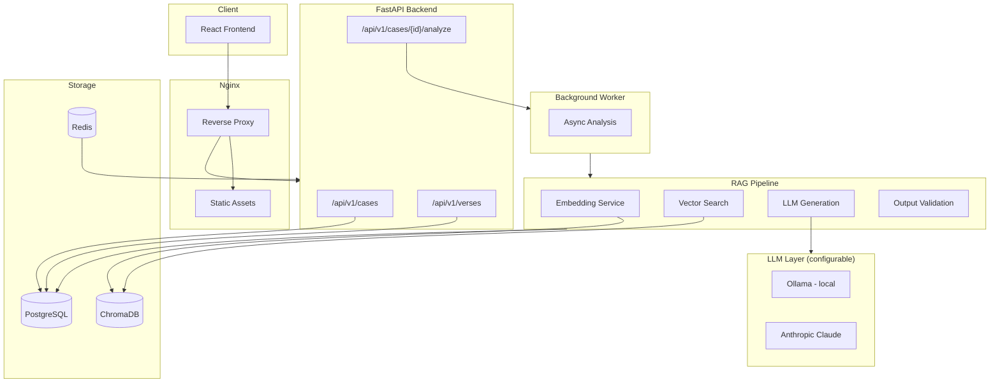
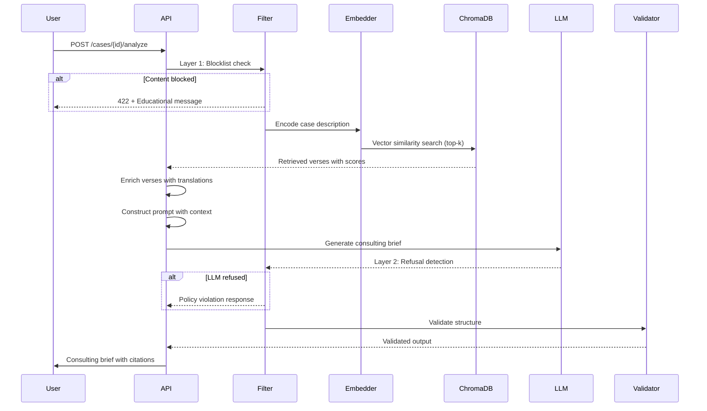
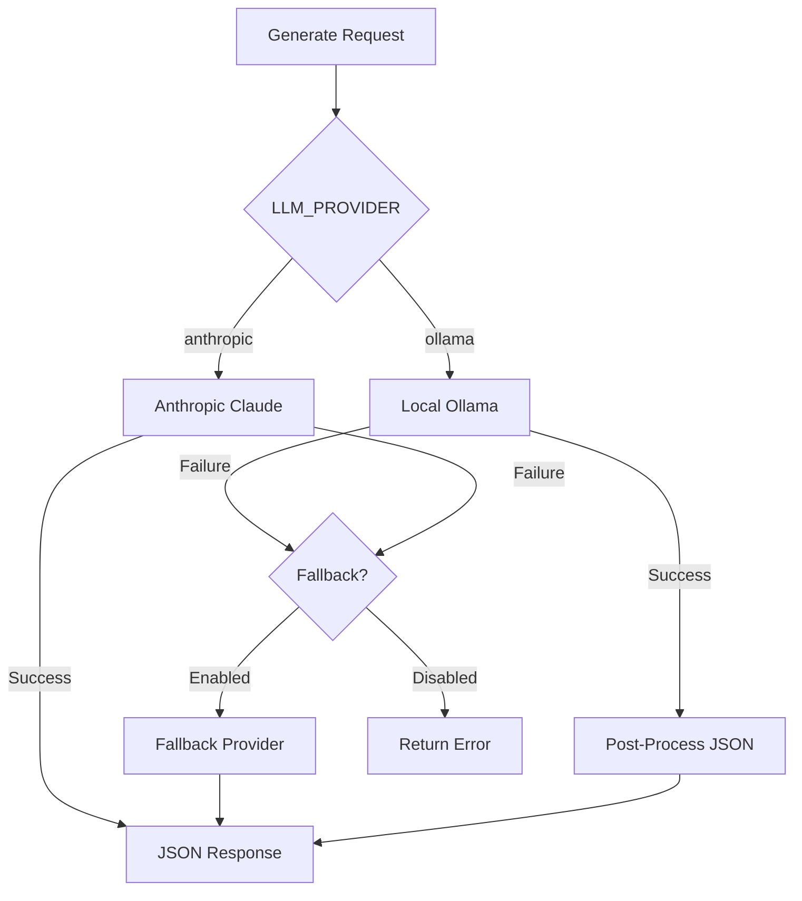
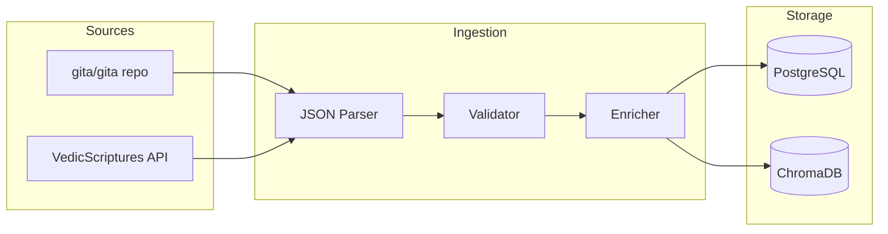

# Building Geetanjali: A RAG System for Ethical Decision Support

## The Problem

Leaders face ethical dilemmas without easy answers. Layoffs versus gradual restructuring. Whistleblowing versus internal resolution. Stakeholder conflicts where every choice carries moral weight.

Traditional decision frameworks (cost-benefit analysis, stakeholder mapping) help structure thinking but don't address the underlying ethical dimensions. Meanwhile, general-purpose LLMs can generate advice but without grounding in established wisdom traditions, their output tends toward generic platitudes.

Geetanjali addresses this gap: provide structured ethical guidance grounded in the Bhagavad Geeta's 701 verses, with explicit citations and confidence scores.

## Why RAG for Ethical Guidance

Retrieval-Augmented Generation solves two problems:

1. **Grounding** - Instead of hallucinating advice, the LLM receives relevant verses as context. Every recommendation traces back to specific scripture.

2. **Transparency** - Users see which verses informed the guidance. They can verify interpretations, explore further, or disagree.

A naive approach would fine-tune an LLM on Geeta content. RAG avoids this because:
- Scripture interpretation evolves; RAG allows updating the knowledge base without retraining
- Citations matter; RAG naturally preserves source attribution
- The corpus is small (701 verses); fine-tuning would likely overfit

## Usage Example

### API Request

```bash
curl -X POST http://localhost:8000/api/v1/cases \
  -H "Content-Type: application/json" \
  -d '{
    "title": "Whistleblowing dilemma",
    "description": "I discovered financial irregularities at my company.
                    Reporting internally has failed. Do I go public?",
    "role": "Senior Manager",
    "stakeholders": ["employees", "shareholders", "regulators"],
    "constraints": ["NDA", "career risk"]
  }'
```

### API Response (Simplified)

```json
{
  "executive_summary": "This case presents a classic tension between
                        loyalty and truth-telling...",
  "options": [
    {
      "title": "Internal Escalation",
      "description": "Escalate to board audit committee...",
      "sources": ["BG_18_63"]
    },
    {
      "title": "External Disclosure",
      "description": "Report to regulators...",
      "sources": ["BG_2_47"]
    },
    {
      "title": "Document and Wait",
      "description": "Preserve evidence, continue internal advocacy...",
      "sources": ["BG_3_19"]
    }
  ],
  "recommended_action": {
    "option": 1,
    "steps": [
      "Request audit committee meeting",
      "Present documented evidence",
      "Set timeline for response"
    ]
  },
  "sources": [
    {
      "canonical_id": "BG_18_63",
      "paraphrase": "Choose with knowledge and freedom after reflection.",
      "relevance": 0.92
    }
  ],
  "confidence": 0.84
}
```

## When to Use Geetanjali

**Good fit:**
- Leadership ethical dilemmas requiring structured analysis
- Situations where traditional wisdom provides perspective
- Decisions benefiting from multiple options with tradeoffs
- Cases where citation and transparency matter

**Not a good fit:**
- Legal or medical decisions (requires professional advice)
- Situations requiring real-time or emergency response
- Contexts where Bhagavad Geeta framework doesn't apply

## Architecture



### Component Responsibilities

| Component | Purpose |
|-----------|---------|
| Nginx | Reverse proxy, TLS termination, static assets, rate limiting |
| PostgreSQL | Cases, users, outputs, verses with translations |
| ChromaDB | 384-dimensional verse embeddings for semantic search |
| Redis | Response caching, session storage, rate limit state |
| Ollama | Local LLM for self-hosted deployments |
| Anthropic Claude | Cloud LLM option when local resources are limited |

## The RAG Pipeline



### Step 1: Embedding

User case descriptions are embedded using `sentence-transformers/all-MiniLM-L6-v2`:

```python
# backend/services/embeddings.py
class EmbeddingService:
    def __init__(self):
        self.model = SentenceTransformer('sentence-transformers/all-MiniLM-L6-v2')

    def encode(self, texts: Union[str, List[str]]) -> List[float]:
        return self.model.encode(texts, normalize_embeddings=True).tolist()
```

Why MiniLM-L6-v2:
- 384 dimensions (compact)
- Fast inference (~14ms per sentence)
- Strong performance on semantic similarity benchmarks
- Runs locally without API calls

### Step 2: Retrieval

ChromaDB finds semantically similar verses:

```python
# backend/services/vector_store.py
def search(self, query: str, top_k: int = 5) -> Dict[str, Any]:
    query_embedding = self.embedding_service.encode(query)

    results = self.collection.query(
        query_embeddings=[query_embedding],
        n_results=top_k
    )

    return {
        "ids": results["ids"][0],
        "distances": results["distances"][0],
        "documents": results["documents"][0],
        "metadatas": results["metadatas"][0]
    }
```

Each verse is stored with metadata:
- `canonical_id`: BG_{chapter}_{verse} (e.g., BG_2_47)
- `paraphrase`: Modern English interpretation
- `principles`: Extracted ethical principles
- `themes`: Categorization tags

### Step 3: Context Construction

Retrieved verses are formatted into a structured prompt:

```python
# backend/services/prompts.py
def build_user_prompt(case_data: Dict, retrieved_verses: List[Dict]) -> str:
    prompt_parts = [
        "# Ethical Dilemma Case\n",
        f"**Title:** {case_data.get('title')}\n",
        f"**Role:** {case_data.get('role')}\n",
        f"**Description:** {case_data.get('description')}\n",
    ]

    prompt_parts.append("\n# Relevant Bhagavad Geeta Verses\n")
    for verse in retrieved_verses:
        canonical_id = verse['metadata']['canonical_id']
        paraphrase = verse['metadata']['paraphrase']
        prompt_parts.append(f"**{canonical_id}**: {paraphrase}\n")

    return "".join(prompt_parts)
```

### Step 4: LLM Generation

The LLM receives the constructed prompt with a system message defining the expected JSON output:

```python
# backend/services/rag.py
def generate_brief(self, prompt: str, retrieved_verses: List[Dict]) -> Dict:
    result = self.llm_service.generate(
        prompt=prompt,
        system_prompt=SYSTEM_PROMPT,
        temperature=0.7,
        fallback_prompt=build_ollama_prompt(case_data, retrieved_verses),
        fallback_system=OLLAMA_SYSTEM_PROMPT
    )

    return json.loads(result["response"])
```

The system prompt enforces structure:

```json
{
  "executive_summary": "...",
  "options": [
    {
      "title": "Option 1",
      "description": "...",
      "pros": ["..."],
      "cons": ["..."],
      "sources": ["BG_2_47"]
    }
  ],
  "recommended_action": {
    "option": 1,
    "steps": ["..."],
    "sources": ["BG_18_63"]
  },
  "reflection_prompts": ["..."],
  "sources": [
    {
      "canonical_id": "BG_2_47",
      "paraphrase": "Act focused on duty, not fruits.",
      "relevance": 0.95
    }
  ],
  "confidence": 0.85,
  "scholar_flag": false
}
```

### Step 5: Validation and Fallback

Output validation ensures completeness and flags low-confidence responses:

```python
# backend/services/rag.py
def validate_output(self, output: Dict) -> Dict:
    required_fields = [
        "executive_summary", "options", "recommended_action",
        "reflection_prompts", "sources", "confidence"
    ]

    for field in required_fields:
        if field not in output:
            output[field] = [] if field != "confidence" else 0.5

    if output["confidence"] < settings.RAG_SCHOLAR_REVIEW_THRESHOLD:
        output["scholar_flag"] = True

    return output
```

## LLM Provider Strategy



### Local-First Design

The system is designed to run entirely self-hosted:

1. **Ollama** (Default)
   - Runs locally, no API costs
   - Works offline
   - Full Docker deployment
   - Prompt optimized for smaller models

2. **Anthropic Claude** (Alternative)
   - Higher quality structured output
   - Faster response times
   - Useful when local GPU resources are limited

Configuration via environment:
```bash
LLM_PROVIDER=ollama           # or "anthropic"
LLM_FALLBACK_PROVIDER=anthropic
LLM_FALLBACK_ENABLED=true
```

The Ollama prompt is optimized for smaller models:

```python
OLLAMA_SYSTEM_PROMPT = """You are an ethical leadership consultant.
Output JSON with: executive_summary, options (3), recommended_action,
reflection_prompts (2), sources, confidence, scholar_flag.
Use verse IDs like BG_2_47. Output ONLY valid JSON."""
```

## Data Pipeline



### Verse Data Structure

```json
{
  "canonical_id": "BG_2_47",
  "chapter": 2,
  "verse": 47,
  "sanskrit_devanagari": "कर्मण्येवाधिकारस्ते...",
  "sanskrit_iast": "karmaṇy-evādhikāras te...",
  "translations": [
    {
      "author": "Swami Sivananda",
      "text": "Your right is to work only..."
    }
  ],
  "paraphrase": "Act focused on duty, not fruits.",
  "principles": ["detachment", "duty", "action"]
}
```

### Embedding Strategy

Each verse is embedded as concatenated text:
- Sanskrit IAST transliteration
- Primary English translation
- Modern paraphrase

This captures both the original language's semantic content and accessible interpretation.

## Key Design Decisions

### Session-Based Anonymous Access

Anonymous users can create cases using session IDs:

```python
@router.post("", response_model=CaseResponse)
async def create_case(
    case_data: CaseCreate,
    current_user: Optional[User] = Depends(get_optional_user),
    session_id: Optional[str] = Depends(get_session_id)
):
    case_dict["user_id"] = current_user.id if current_user else None
    case_dict["session_id"] = session_id
```

This lowers friction for first-time users while allowing authenticated users to build persistent history.

### Content Moderation

A two-layer system handles inappropriate content while maintaining focus on genuine ethical dilemmas:

```
User Input → [Layer 1: Blocklist] → LLM → [Layer 2: Refusal Detection] → Response
```

**Layer 1 (Pre-submission):** Regex blocklist catches explicit content before database write. Returns HTTP 422 with educational message suggesting how to rephrase.

**Layer 2 (Post-LLM):** Detects when Claude refuses to process content (pattern matching on "I can't assist...", "This request contains..."). Returns a policy violation response with guidance on rephrasing.

Both layers use educational messaging—helping users understand what Geetanjali is designed for rather than punishing bad requests. No user content is logged; only violation types for monitoring.

Configuration via environment:
```bash
CONTENT_FILTER_ENABLED=true              # Master switch
CONTENT_FILTER_BLOCKLIST_ENABLED=true    # Layer 1
CONTENT_FILTER_LLM_REFUSAL_DETECTION=true # Layer 2
```

See [Content Moderation](CONTENT-MODERATION.md) for pattern details and extending the blocklist.

### Graceful Degradation

The pipeline never fails completely:

```python
def run(self, case_data: Dict, top_k: int = None) -> Dict:
    # Step 1: Try verse retrieval
    try:
        retrieved_verses = self.retrieve_verses(query, top_k)
    except Exception:
        retrieved_verses = []  # Continue without verses

    # Step 2: Try LLM generation
    try:
        output = self.generate_brief(prompt, ...)
    except Exception:
        return self._create_fallback_response(case_data, "LLM unavailable")

    # Step 3: Validate (with defaults for missing fields)
    return self.validate_output(output)
```

## Operations

### Deployment

Docker Compose orchestrates seven containers:

```
nginx (frontend)     → reverse proxy, static assets, TLS
backend (FastAPI)    → API server
worker (RQ)          → async RAG processing
postgres             → relational data
redis                → cache, rate limits, job queue
chromadb             → vector store
ollama               → local LLM (optional)
```

Key deployment features:
- Single `docker compose up` brings up entire stack
- Background worker handles long-running RAG jobs
- Nginx serves static assets with aggressive caching (1 year for hashed files)
- Rate limiting at both nginx and application layers

### Security

Container hardening:
- Non-root users in all containers
- Minimal Linux capabilities (drop all, add only required)
- Internal services not exposed to host network
- Redis authentication enabled

Secrets management:
- SOPS + age encryption for `.env` files
- Encrypted secrets committed to git, decrypted at deploy time
- No plaintext credentials in repository

Application security:
- CSRF protection on state-changing endpoints
- Security headers (HSTS, CSP, X-Frame-Options)
- Rate limiting (60 req/min per IP on most endpoints)
- Session-based anonymous access (no PII required)

### Performance

| Operation | Latency |
|-----------|---------|
| Embedding (per query) | ~15ms |
| Vector search (top-5) | ~25ms |
| LLM generation (Ollama local) | 15-30s |
| LLM generation (Anthropic Claude) | 2-5s |
| Total pipeline (local) | 20-35s |
| Total pipeline (cloud) | 3-8s |

Load tested at 682 req/s on health endpoints, 60 req/min rate limit on API.

## Conclusion

Geetanjali demonstrates that RAG can bring ancient wisdom into modern decision support. The key is treating scripture not as training data but as retrievable context—preserving attribution and enabling verification.

The architecture patterns here (local-first LLM, graceful degradation, confidence scoring) apply broadly to any domain-specific RAG system where grounding and transparency matter.

---

**Live:** [geetanjaliapp.com](https://geetanjaliapp.com) · **Source:** [GitHub](https://github.com/geetanjaliapp/geetanjali) · MIT License
