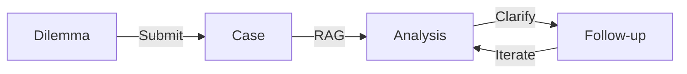
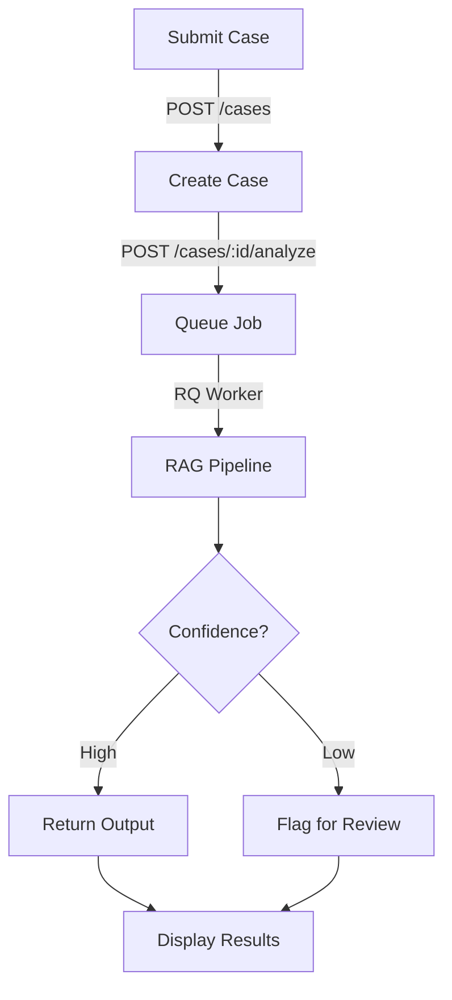
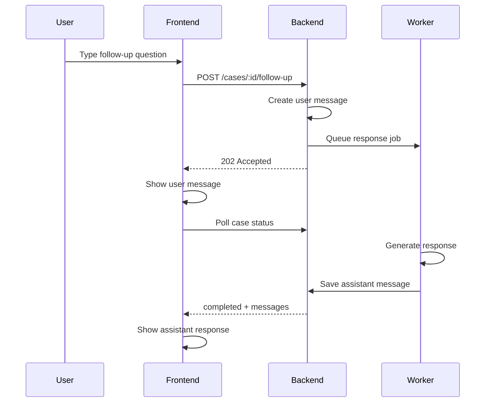
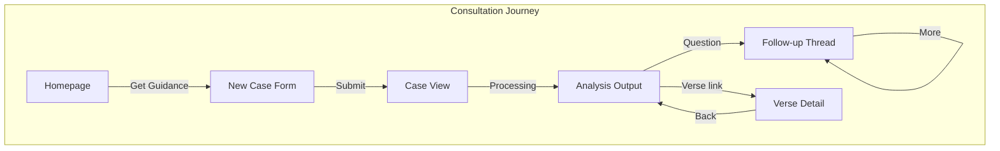

# Consultation Journey

How users receive personalized ethical guidance from the Bhagavad Geeta.

## Overview

The consultation journey transforms ethical dilemmas into actionable guidance grounded in scripture.



| Stage | User Action | System Response |
|-------|-------------|-----------------|
| **Submit** | Describe ethical dilemma | Case created, queued for analysis |
| **Analyze** | Wait (~30s) | RAG pipeline generates structured guidance |
| **Review** | Read options, citations | Display formatted output with verse links |
| **Follow-up** | Ask clarifying questions | Conversational refinement |

## Case Submission

Users start by describing their ethical dilemma.

```
┌──────────────────────────────────────────────────────────────┐
│  /cases/new                                                  │
├──────────────────────────────────────────────────────────────┤
│                                                              │
│  What dilemma are you facing?                                │
│                                                              │
│   ┌──────────────────────────────────────────────────────┐   │
│   │  I'm a team lead facing a decision about whether     │   │
│   │  to report a colleague's minor expense violations... │   │
│   └──────────────────────────────────────────────────────┘   │
│                                                              │
│   ┌─ Example Questions (shown when < 10 chars) ──────────┐   │
│   │  • My boss asked me to take credit for a colleague's │   │
│   │    work. What should I do?                           │   │
│   │  • Should I leave a stable job to pursue something   │   │
│   │    I'm passionate about?                             │   │
│   └──────────────────────────────────────────────────────┘   │
│                                                              │
│  Background & constraints (optional)                         │
│   ┌──────────────────────────────────────────────────────┐   │
│   │  Competing values, fears, past experiences...        │   │
│   └──────────────────────────────────────────────────────┘   │
│                                                              │
│   ┌─ Personalize your guidance (collapsible) ────────────┐   │
│   │                                                      │   │
│   │  I'm asking as a...                                  │   │
│   │  [Individual] [Parent] [Manager] [Employee] ...      │   │
│   │                                                      │   │
│   │  This decision affects...                            │   │
│   │  [Self] [Family] [Team] [Organization] [Community]   │   │
│   │                                                      │   │
│   └──────────────────────────────────────────────────────┘   │
│                                                              │
│                                      [ Get Guidance ]        │
│                                                              │
└──────────────────────────────────────────────────────────────┘
```

**Form Features:**
- Question field (required, min 10 characters)
- Context field (optional background/constraints)
- Example questions appear when question < 10 chars (3 random from pool of 8)
- Collapsible personalization: role selection + stakeholder multi-select
- Content validation (gibberish/abuse detection)

**Roles:**
Individual, Parent, Manager/Leader, Employee, Student, Entrepreneur

**Stakeholders:**
Self, Family, Team, Organization, Community

## Analysis Flow



**Processing States:**

| State | UI Display | Duration |
|-------|------------|----------|
| `pending` | "Analyzing..." with progress stages | ~1s |
| `processing` | Animated stages + wisdom quotes | 1-3 min |
| `completed` | Full output with verse citations | — |
| `failed` | Error message + "Try Again" button | — |
| `policy_violation` | Educational message + rephrase suggestions | — |

**RAG Pipeline:**
1. Embed user query using sentence-transformers
2. Vector search against 701 verses in ChromaDB
3. Retrieve top-k relevant verses with confidence scores
4. Generate structured output via LLM (Ollama/Claude)
5. Parse and validate JSON response
6. Store output linked to case

## Analysis Output

Structured guidance with multiple perspectives.

```
┌──────────────────────────────────────────────────────────────┐
│  /cases/:id                                                  │
├──────────────────────────────────────────────────────────────┤
│                                                              │
│  ┌─ Your Question ──────────────────────────────────────┐    │
│  │  I'm a team lead facing a decision about whether     │    │
│  │  to report a colleague's expense violations...       │    │
│  │                                    [Manager] [Team]  │    │
│  └──────────────────────────────────────────────────────┘    │
│                                                              │
│  ┌─ Wisdom from the Geeta ──────────────────────────────┐    │
│  │                                                      │    │
│  │  The Geeta emphasizes dharma (righteous duty)        │    │
│  │  while also recognizing the complexity...            │    │
│  │                                                      │    │
│  │  [▼ 3 verse references]                              │    │
│  │  ┌───────────────────────────────────────────────┐   │    │
│  │  │ 2 47  "Focus on right action..."  [View →]    │   │    │
│  │  │ 3 19  "Perform duty without..."   [View →]    │   │    │
│  │  └───────────────────────────────────────────────┘   │    │
│  │                                                      │    │
│  │  [👍] [👎 + comment]                                 │    │
│  └──────────────────────────────────────────────────────┘    │
│                                                              │
│  ┌─ Paths Before You ───────────────────────────────────┐    │
│  │  ┌─────────────┐ ┌─────────────┐ ┌─────────────┐     │    │
│  │  │ Path 1      │ │ Path 2      │ │ Path 3      │     │    │
│  │  │ Direct talk │ │ Report      │ │ Wait & see  │     │    │
│  │  │ ✓ Preserves │ │ ✓ Clear     │ │ ✓ Low risk  │     │    │
│  │  │ ✗ May fail  │ │ ✗ Tension   │ │ ✗ Enables   │     │    │
│  │  └─────────────┘ └─────────────┘ └─────────────┘     │    │
│  └──────────────────────────────────────────────────────┘    │
│                                                              │
│  ┌─ Recommended Steps ──────────────────────────────────┐    │
│  │  1. Schedule a private conversation                  │    │
│  │  2. Focus on impact, not blame                       │    │
│  │  3. Document the discussion                          │    │
│  └──────────────────────────────────────────────────────┘    │
│                                                              │
│  ┌─ Questions for Reflection ───────────────────────────┐    │
│  │  • What outcome would make you feel at peace?        │    │
│  │  • What would you advise a friend in this situation? │    │
│  └──────────────────────────────────────────────────────┘    │
│                                                              │
│  ┌──────────────────────────────────────────────────────┐    │
│  │  [Ask a follow-up question...                   ] ↵  │    │
│  └──────────────────────────────────────────────────────┘    │
│                                                              │
└──────────────────────────────────────────────────────────────┘
```

**Output Components:**

| Section | Purpose |
|---------|---------|
| Guidance | Markdown-formatted wisdom from the Geeta |
| Verse References | Expandable list of supporting citations with paraphrases |
| Paths Before You | 2-3 options with benefits/considerations (scrollable cards) |
| Recommended Steps | Numbered actionable next steps |
| Questions for Reflection | Prompts for deeper contemplation |
| Feedback | Thumbs up/down with optional comment |

**Additional Indicators:**
- Scholar flag: amber warning for low-confidence responses
- Role/stakeholder tags: shown on user's question
- Public sharing toggle: generate shareable link

## Follow-up Conversations

Users can ask clarifying questions after initial analysis.



**Conversation Flow:**
```
┌──────────────────────────────────────────────────────────────┐
│  Conversation                                                │
├──────────────────────────────────────────────────────────────┤
│                                                              │
│   ┌─ You ────────────────────────────────────────────────┐   │
│   │                                                      │   │
│   │  What if my colleague refuses to acknowledge         │   │
│   │  the issue when I bring it up?                       │   │
│   │                                                      │   │
│   └──────────────────────────────────────────────────────┘   │
│                                                              │
│   ┌─ Geetanjali ─────────────────────────────────────────┐   │
│   │                                                      │   │
│   │  If direct conversation doesn't resolve the          │   │
│   │  situation, the Geeta's teaching on nishkama         │   │
│   │  karma (desireless action) suggests focusing on      │   │
│   │  your dharma rather than the outcome. You've         │   │
│   │  fulfilled your duty by giving them the              │   │
│   │  opportunity to self-correct...                      │   │
│   │                                                      │   │
│   └──────────────────────────────────────────────────────┘   │
│                                                              │
│   ┌─ You ────────────────────────────────────────────────┐   │
│   │  How do I know when it's time to escalate?           │   │
│   └──────────────────────────────────────────────────────┘   │
│                                                              │
│   ┌─ Geetanjali ─────────────────────────────────────────┐   │
│   │  ● ● ●                                               │   │
│   └──────────────────────────────────────────────────────┘   │
│                                                              │
│   ┌──────────────────────────────────────────────────────┐   │
│   │  [Ask another question...                       ] ↵  │   │
│   └──────────────────────────────────────────────────────┘   │
│                                                              │
└──────────────────────────────────────────────────────────────┘
```

**Follow-up Features:**
- Async processing: HTTP 202 returns user message immediately
- Context-aware: uses prior consultation without full RAG
- Animated "Contemplating..." indicator with wisdom quotes
- Enter to submit, Shift+Enter for newline
- Each response can have expandable verse sources and feedback

## User Flow Summary



**Entry Points:**
- Homepage hero CTA → New Case Form
- Navbar "Get Guidance" → New Case Form
- Direct URL `/case/new` → New Case Form

**Exit Points:**
- Verse links → Discovery Journey (verse detail)
- "Browse Verses" → Discovery Journey (grid)
- Share link → External

## Technical Notes

**API Endpoints:**
```
POST /api/v1/cases                    # Create case
POST /api/v1/cases/{id}/analyze/async # Queue analysis (returns immediately)
GET  /api/v1/cases/{id}               # Get case + status
GET  /api/v1/cases/{id}/outputs       # Get analysis outputs
POST /api/v1/cases/{id}/follow-up     # Submit follow-up (HTTP 202)
GET  /api/v1/cases/{id}/messages      # Get conversation history
POST /api/v1/outputs/{id}/feedback    # Submit feedback
POST /api/v1/cases/{id}/share         # Toggle public sharing
POST /api/v1/cases/{id}/retry         # Retry failed analysis
DELETE /api/v1/cases/{id}             # Soft delete case
```

**Processing:**
- Analysis jobs run via RQ (Redis Queue)
- Typical processing time: 1-3 minutes
- Frontend polls every 5 seconds during processing
- Progress stages: Preparing → Finding wisdom → Contemplating → Composing

**Content Moderation:**
- Input validated for harmful content (gibberish/abuse detection)
- Policy violations return educational suggestions
- Low-confidence responses flagged with "scholar_flag"
- See [Content Moderation](content-moderation.md) for details

**Accessibility:**
- Form labels and ARIA attributes
- Loading state announcements with progress stages
- Keyboard navigation throughout
- Focus management on state changes
