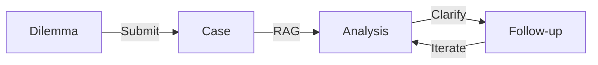
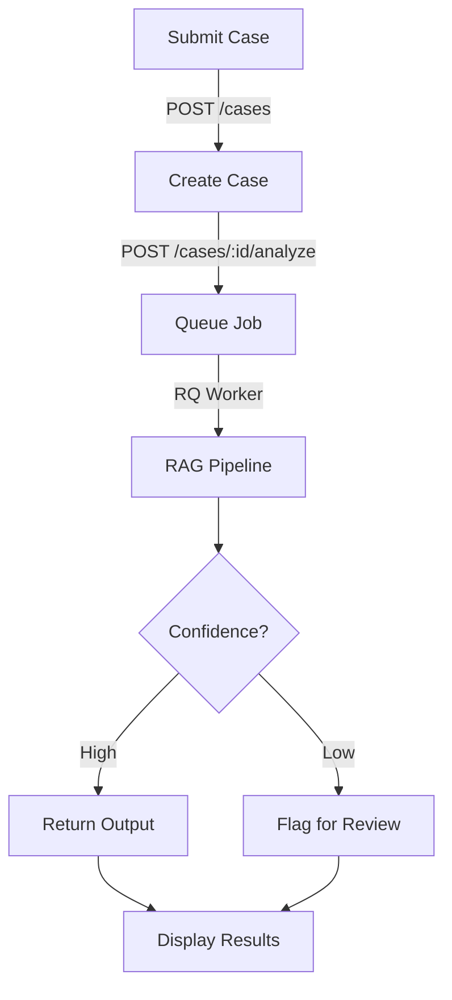
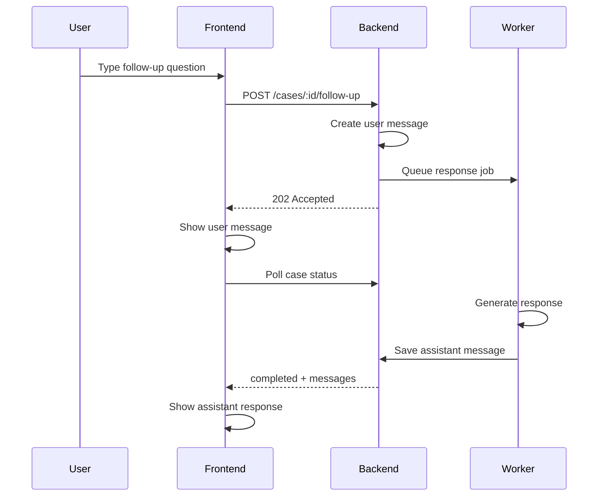
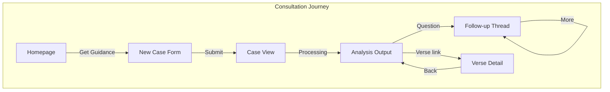

# Consultation Journey

How users receive personalized ethical guidance from the Bhagavad Geeta.

## Overview

The consultation journey transforms ethical dilemmas into actionable guidance grounded in scripture.



| Stage | User Action | System Response |
|-------|-------------|-----------------|
| **Submit** | Describe ethical dilemma | Case created, queued for analysis |
| **Analyze** | Wait (~30s) | RAG pipeline generates structured guidance |
| **Review** | Read options, citations | Display formatted output with verse links |
| **Follow-up** | Ask clarifying questions | Conversational refinement |

## Case Submission

Users start by describing their ethical dilemma.

```
┌──────────────────────────────────────────────────┐
│ /case/new                                        │
├──────────────────────────────────────────────────┤
│                                                  │
│ Describe Your Situation                          │
│ ───────────────────────                          │
│                                                  │
│ ┌──────────────────────────────────────────────┐│
│ │ I'm a team lead facing a decision about     ││
│ │ whether to report a colleague's minor       ││
│ │ expense violations...                       ││
│ └──────────────────────────────────────────────┘│
│                                                  │
│ [Example Questions ▼]                            │
│                                                  │
│ ┌─ Personalize (Optional) ────────────────────┐ │
│ │ Role: [Team Lead ▼]                         │ │
│ │ Stakeholders: [◉ Team] [◉ Org] [○ Family]  │ │
│ └─────────────────────────────────────────────┘ │
│                                                  │
│                        [ Get Guidance ]          │
│                                                  │
└──────────────────────────────────────────────────┘
```

**Form Features:**
- Free-form text input (no templates)
- Example questions for inspiration
- Optional personalization (role, stakeholders)
- Single CTA with clear action

**Example Questions:**
Clicking reveals curated prompts users can adapt:
- "How do I handle a conflict between loyalty and honesty?"
- "What guidance does the Geeta offer on difficult decisions?"
- "How should I approach a situation where doing right may hurt someone?"

## Analysis Flow



**Processing States:**

| State | UI Display | Duration |
|-------|------------|----------|
| `created` | Form submitted | Instant |
| `pending` | "Analyzing..." spinner | ~1s |
| `processing` | Progress indicator | ~30s |
| `completed` | Full output | — |
| `failed` | Error message + retry | — |

**RAG Pipeline:**
1. Embed user query using sentence-transformers
2. Vector search against 701 verses in ChromaDB
3. Retrieve top-k relevant verses with confidence scores
4. Generate structured output via LLM (Ollama/Claude)
5. Parse and validate JSON response
6. Store output linked to case

## Analysis Output

Structured guidance with multiple perspectives.

```
┌──────────────────────────────────────────────────┐
│ /case/:id                                        │
├──────────────────────────────────────────────────┤
│                                                  │
│ Your Situation                                   │
│ ───────────────                                  │
│ I'm a team lead facing a decision about         │
│ whether to report a colleague's minor           │
│ expense violations...                           │
│                                                  │
├──────────────────────────────────────────────────┤
│                                                  │
│ Guidance                                         │
│ ────────                                         │
│                                                  │
│ ┌─ Summary ────────────────────────────────────┐│
│ │ The Geeta emphasizes dharma while also      ││
│ │ recognizing interpersonal complexity...     ││
│ └──────────────────────────────────────────────┘│
│                                                  │
│ Options                                          │
│ ───────                                          │
│ ┌─ Option 1: Direct conversation ─────────────┐│
│ │ Approach colleague privately first.         ││
│ │ Honors truth (satya) and compassion (daya).││
│ │                                             ││
│ │ + Preserves relationship                    ││
│ │ + Gives opportunity to self-correct         ││
│ │ - May not resolve if behavior continues     ││
│ └─────────────────────────────────────────────┘│
│                                                  │
│ ┌─ Option 2: Report through channels ─────────┐│
│ │ ...                                         ││
│ └─────────────────────────────────────────────┘│
│                                                  │
│ Relevant Verses                                  │
│ ───────────────                                  │
│ ┌──────────────────────────────────────────────┐│
│ │ BG 2.47 — कर्मण्येवाधिकारस्ते...              ││
│ │ "You have the right to work only..."        ││
│ │ Relevance: Focus on action, not outcomes    ││
│ │                            [View Verse →]   ││
│ └──────────────────────────────────────────────┘│
│                                                  │
│ ┌─ Ask a Follow-up Question ──────────────────┐│
│ │ [Type your question here...            ] ↵ ││
│ └─────────────────────────────────────────────┘│
│                                                  │
└──────────────────────────────────────────────────┘
```

**Output Components:**

| Section | Purpose |
|---------|---------|
| Summary | Executive overview of guidance |
| Options | 2-3 actionable paths with tradeoffs |
| Recommendation | Suggested approach (when confident) |
| Implementation | Concrete next steps |
| Reflection | Prompts for deeper contemplation |
| Verses | Supporting citations with links |

**Verse Citations:**
- Clickable links to verse detail pages
- Shows Sanskrit, translation snippet, relevance
- Confidence score (hidden from UI, used for flagging)

## Follow-up Conversations

Users can ask clarifying questions after initial analysis.



**Conversation Flow:**
```
┌──────────────────────────────────────────────────┐
│ Conversation                                     │
├──────────────────────────────────────────────────┤
│                                                  │
│ ┌─ You ────────────────────────────────────────┐│
│ │ What if my colleague refuses to acknowledge ││
│ │ the issue?                                  ││
│ └──────────────────────────────────────────────┘│
│                                                  │
│ ┌─ Geetanjali ─────────────────────────────────┐│
│ │ If direct conversation doesn't resolve the  ││
│ │ situation, the Geeta's teaching on nishkama ││
│ │ karma suggests focusing on your dharma      ││
│ │ rather than the outcome...                  ││
│ └──────────────────────────────────────────────┘│
│                                                  │
│ ┌─ You ────────────────────────────────────────┐│
│ │ How do I know when it's time to escalate?   ││
│ └──────────────────────────────────────────────┘│
│                                                  │
│ ┌─ Geetanjali ─────────────────────────────────┐│
│ │ ● ● ●                                        ││
│ └──────────────────────────────────────────────┘│
│                                                  │
│ ┌──────────────────────────────────────────────┐│
│ │ [Ask another question...                ] ↵ ││
│ └──────────────────────────────────────────────┘│
│                                                  │
└──────────────────────────────────────────────────┘
```

**Follow-up Features:**
- Async processing (non-blocking)
- Context-aware (uses prior consultation)
- No full RAG regeneration (lighter processing)
- Rate limited (30/hour vs 10/hour for analysis)

## User Flow Summary



**Entry Points:**
- Homepage hero CTA → New Case Form
- Navbar "Get Guidance" → New Case Form
- Direct URL `/case/new` → New Case Form

**Exit Points:**
- Verse links → Discovery Journey (verse detail)
- "Browse Verses" → Discovery Journey (grid)
- Share link → External

## Technical Notes

**API Endpoints:**
```
POST /api/v1/cases                    # Create case
POST /api/v1/cases/{id}/analyze       # Queue analysis
GET  /api/v1/cases/{id}               # Get case + status
GET  /api/v1/cases/{id}/output        # Get analysis output
POST /api/v1/cases/{id}/follow-up     # Submit follow-up
GET  /api/v1/cases/{id}/messages      # Get conversation
POST /api/v1/outputs/{id}/feedback    # Submit feedback
```

**Processing:**
- Analysis jobs run via RQ (Redis Queue)
- Typical processing time: 20-40 seconds
- Frontend polls every 2 seconds during processing
- Timeout after 5 minutes with retry option

**Content Moderation:**
- Input validated for harmful content
- Output checked before display
- Low-confidence responses flagged
- See [Content Moderation](content-moderation.md) for details

**Accessibility:**
- Form labels and ARIA attributes
- Loading state announcements
- Keyboard navigation throughout
- Focus management on state changes
