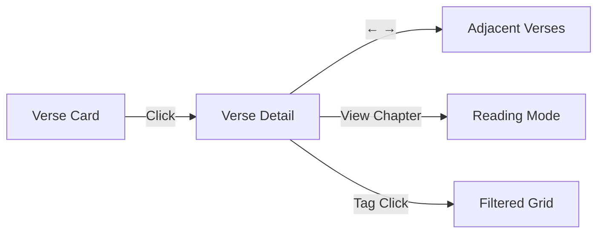
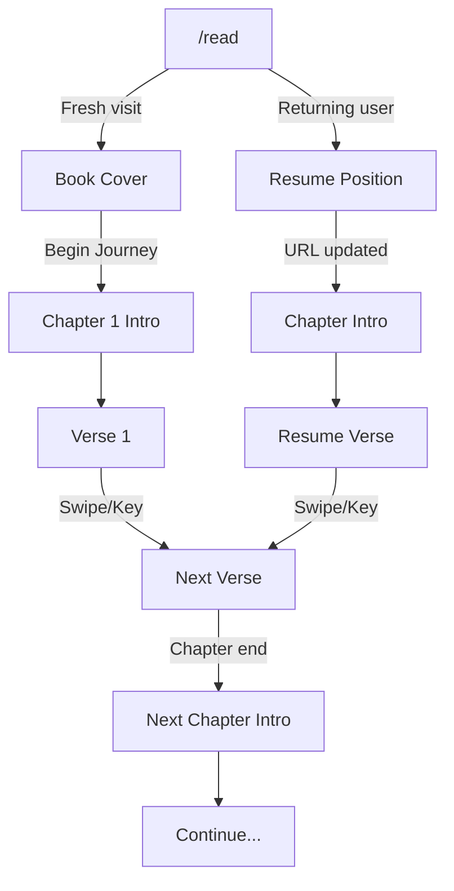
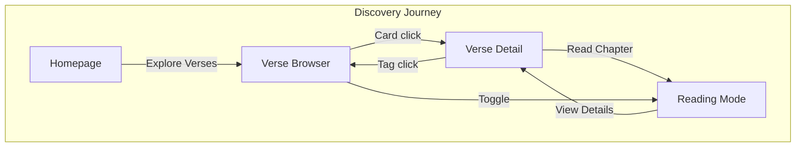

# Discovery Journey

How users discover and absorb scripture through browsing and reading.

## Overview

Geetanjali serves two user modes:

| Mode | User Intent | Experience |
|------|-------------|------------|
| **Seeking** | "Find a verse about duty" | Verse Browser — search, filter, explore |
| **Reading** | "Read Chapter 2 in order" | Reading Mode — sequential, immersive |

Both modes provide access to 701 verses across 18 chapters with Sanskrit text, transliterations, and translations.

## Verse Browser

Grid-based exploration for discovery and research.

```
┌──────────────────────────────────────────────────┐
│ /verses                                          │
├──────────────────────────────────────────────────┤
│ [Chapter ▼] [Topics...]        [Grid│Reading]   │
├──────────────────────────────────────────────────┤
│ ┌──────────┐ ┌──────────┐ ┌──────────┐          │
│ │ Sanskrit │ │ Sanskrit │ │ Sanskrit │          │
│ │ verse    │ │ verse    │ │ verse    │          │
│ │──────────│ │──────────│ │──────────│          │
│ │Paraphrase│ │Paraphrase│ │Paraphrase│          │
│ │[tags]    │ │[tags]    │ │[tags]    │          │
│ └──────────┘ └──────────┘ └──────────┘          │
│                                                  │
│ ┌──────────┐ ┌──────────┐ ┌──────────┐          │
│ │  ...     │ │  ...     │ │  ...     │          │
└──────────────────────────────────────────────────┘
```

**Features:**
- Chapter dropdown filter
- Topic/principle filter pills (Dharma, Karma Yoga, etc.)
- Clickable tags for quick filtering
- Card preview with Sanskrit, paraphrase, and tags
- Responsive grid (1-4 columns based on viewport)

**Card → Detail Flow:**



## Verse Detail

Single verse deep-dive with full context.

```
┌──────────────────────────────────────────────────┐
│ Chapter 2: Sankhya Yoga         [← Prev][Next →]│
│ Verse 47 of 72  ▓▓▓▓▓▓▓░░░░ 65%                 │
├──────────────────────────────────────────────────┤
│                      ॐ                           │
│                                                  │
│     कर्मण्येवाधिकारस्ते मा फलेषु कदाचन।          │
│     मा कर्मफलहेतुर्भूर्मा ते सङ्गोऽस्त्वकर्मणि॥    │
│                                                  │
│ ┌──────────────────────────────────────────────┐│
│ │ IAST: karmaṇy-evādhikāras te mā phaleṣu...  ││
│ └──────────────────────────────────────────────┘│
│ ┌──────────────────────────────────────────────┐│
│ │ You have the right to work only, but never  ││
│ │ to its fruits...     — Swami Sivananda      ││
│ └──────────────────────────────────────────────┘│
│                                                  │
│ [Karma Yoga] [Detachment] [Action]    [📤 Share]│
└──────────────────────────────────────────────────┘
```

**Features:**
- Chapter context bar with progress indicator
- Large Sanskrit display with Om symbol
- IAST transliteration
- Multiple translations (Hindi, English)
- Clickable principle tags → filtered grid
- Keyboard navigation (← → arrows)
- Share functionality

## Reading Mode

Sequential reading for scripture study.



**Design Philosophy:**
- Sanskrit-first — large Devanagari as hero text
- Progressive disclosure — tap to reveal translations
- Flow state — minimal chrome, distraction-free
- Mobile-native — swipe gestures as primary navigation

**Screen States:**

| State | Display | Action |
|-------|---------|--------|
| Book Cover | Title, tagline, "Begin Journey" | Tap CTA or swipe |
| Chapter Intro | Chapter name, summary, themes | Tap CTA or swipe |
| Verse Focus | Sanskrit hero, tap for translation | Tap verse or swipe |

**Navigation:**

| Input | Mobile | Desktop |
|-------|--------|---------|
| Next | Swipe left | → or J |
| Previous | Swipe right | ← or K |
| Toggle translation | Tap verse | Space |
| Chapter select | Bottom nav button | Bottom nav button |
| Reset progress | Header reset icon | Header reset icon |

**Persistence:**

```
localStorage
├── geetanjali:readingPosition
│   ├── chapter: number
│   ├── verse: number
│   └── timestamp: ISO8601
└── geetanjali:readingSettings
    └── fontSize: "small" | "medium" | "large"
```

- Position saved automatically on verse change
- URL syncs with position (`?c=2&v=47`)
- Translation visibility persists within chapter
- Reset button clears all saved state

## User Flow Summary



**Entry Points:**
- Homepage "Explore Verses" → Grid
- Navbar "Verses" → Grid
- Grid toggle → Reading Mode
- Verse Detail "Read Chapter" → Reading Mode
- Direct URL `/read?c=2&v=47` → Reading Mode

## Technical Notes

**API Endpoints:**
```
GET /api/v1/verses                    # List with filters
GET /api/v1/verses/{canonical_id}     # Single verse
GET /api/v1/verses/{id}/translations  # Verse translations
GET /api/v1/reading/book              # Book metadata
GET /api/v1/reading/chapters/{n}      # Chapter metadata
```

**Performance:**
- Chapter prefetching at 80% progress
- Translation lazy loading (fetched on reveal)
- Verse cache in React state
- Skeleton loading states

**Accessibility:**
- Keyboard navigation throughout
- Screen reader labels
- Focus management on navigation
- Reduced motion support
