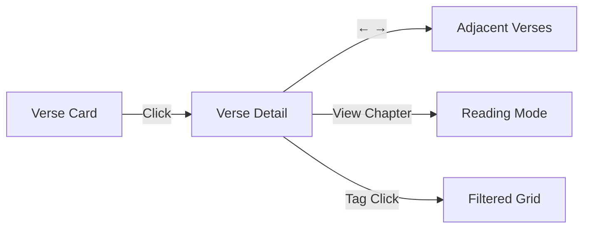
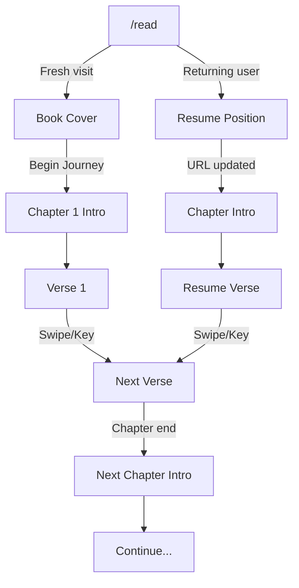
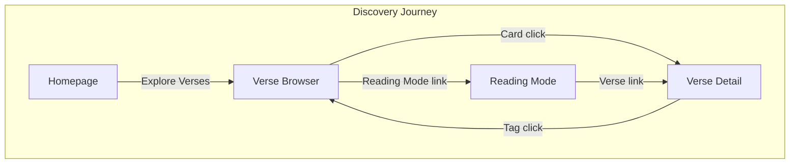

# Discovery Journey

How users discover and absorb scripture through browsing and reading.

## Overview

Geetanjali serves two user modes:

| Mode | User Intent | Experience |
|------|-------------|------------|
| **Seeking** | "Find a verse about duty" | Verse Browser — filter, explore |
| **Reading** | "Read Chapter 2 in order" | Reading Mode — sequential, immersive |

Both modes provide access to 701 verses across 18 chapters with Sanskrit text, transliterations, and translations.

## Verse Browser

Grid-based exploration for discovery and research.

```
┌──────────────────────────────────────────────────────────────┐
│  /verses                                       [Reading Mode]│
├──────────────────────────────────────────────────────────────┤
│                                                              │
│  [Featured] [All]    [Chapter ▼]    [Topic Pills...]         │
│                                                              │
├──────────────────────────────────────────────────────────────┤
│                                                              │
│    ┌─────────────┐   ┌─────────────┐   ┌─────────────┐       │
│    │ ★ 2.47      │   │   3.19      │   │ ★ 2.48      │       │
│    │  Sanskrit   │   │  Sanskrit   │   │  Sanskrit   │       │
│    ├─────────────┤   ├─────────────┤   ├─────────────┤       │
│    │ Translation │   │ Translation │   │ Translation │       │
│    │ [tag] [tag] │   │ [tag] [tag] │   │ [tag] [tag] │       │
│    └─────────────┘   └─────────────┘   └─────────────┘       │
│                                                              │
│                      [ Continue ]                            │
│                                                              │
└──────────────────────────────────────────────────────────────┘
```

**Features:**
- Featured/All toggle (curated verses vs all 701)
- Chapter dropdown filter (18 chapters in grid layout)
- Topic/principle filter pills (scrollable, from taxonomy)
- Clickable tags for quick filtering
- Card preview: verse reference, Sanskrit, translation snippet, principle tags
- Responsive grid (1-4 columns based on viewport)
- Infinite scroll with "Continue" button

**Card → Detail Flow:**



## Verse Detail

Single verse deep-dive with full context.

```
┌──────────────────────────────────────────────────────────────┐
│  [←]  Chapter 2: Sankhya Yoga              Verse 47 of 72    │
│       ████████████████████░░░░░░░░░░ 65%                     │
├──────────────────────────────────────────────────────────────┤
│                                                              │
│                            ॐ                                 │
│         कर्मण्येवाधिकारस्ते मा फलेषु कदाचन।                              │
│         मा कर्मफलहेतुर्भूर्मा ते सङ्गोऽस्त्वकर्मणि॥                         │
│                                  ॥ २.४७ ॥                    │
│                                                              │
│   ┌─ Leadership Insight ─────────────────────────────────┐   │
│   │ Focus on your duty without attachment to outcomes.   │   │
│   │ Right action done for its own sake brings clarity.   │   │
│   └──────────────────────────────────────────────────────┘   │
│                                                              │
│   [Karma Yoga →]  [Detachment →]  [Nishkama Karma →]         │
│                                                              │
│   ┌─ Hindi ──────────────────────────────────────────────┐   │
│   │ कर्म करने में ही तेरा अधिकार है...                             │   │
│   └──────────────────────────────────────────────────────┘   │
│                                                              │
│   ┌─ English ────────────────────────────────────────────┐   │
│   │ You have the right to work only, but never to its    │   │
│   │ fruits...                — Swami Gambirananda        │   │
│   └──────────────────────────────────────────────────────┘   │
│                                                              │
│   [Show More Translations]                                   │
│                                                              │
│   [◀ Prev]                                        [Next ▶]   │
└──────────────────────────────────────────────────────────────┘
```

**Features:**
- Chapter context bar with back button and progress indicator
- Sanskrit Spotlight: Om symbol, Devanagari text, verse reference with marks
- Leadership Insight: paraphrase for practical application
- Consulting Principles: clickable tags → filtered grid
- Primary translations: Hindi and English (side-by-side on desktop)
- "More Translations" toggle for additional versions
- Floating nav arrows (desktop) or sticky bottom nav (mobile)
- Keyboard navigation (← → arrows)
- Adjacent verse prefetching

## Reading Mode

Sequential reading for scripture study.



**Design Philosophy:**
- Sanskrit-first — large Devanagari as hero text
- Progressive disclosure — tap to reveal translations
- Flow state — minimal chrome, distraction-free
- Mobile-native — swipe gestures as primary navigation

**Screen States:**

| State | Display | Action |
|-------|---------|--------|
| Book Cover | Title, tagline, "Begin Journey" | Tap CTA or swipe |
| Chapter Intro | Chapter name, summary, themes | Tap CTA or swipe |
| Verse Focus | Sanskrit hero, tap for translation | Tap verse or swipe |

**Navigation:**

| Input | Mobile | Desktop |
|-------|--------|---------|
| Next | Swipe left | → or J |
| Previous | Swipe right | ← or K |
| Toggle translation | Tap verse | Tap verse |
| Chapter select | Bottom nav button | Bottom nav button |
| Font size | Bottom nav button (cycles small/medium/large) | Same |

**Persistence:**

```
localStorage
├── geetanjali:readingPosition
│   ├── chapter: number
│   ├── verse: number
│   └── timestamp: ISO8601
├── geetanjali:readingSettings
│   └── fontSize: "small" | "medium" | "large"
└── geetanjali:readingOnboardingSeen
    └── boolean (first-time tips)
```

- Position saved automatically on verse change
- URL syncs with position (`?c=2&v=47`)
- Deep links take priority over saved position
- First-time onboarding overlay with navigation tips

## User Flow Summary



**Entry Points:**
- Homepage "Explore Verses" → Verse Browser
- Navbar "Verses" → Verse Browser
- Verse Browser "Reading Mode" link → Reading Mode
- Direct URL `/read?c=2&v=47` → Reading Mode at position

## Technical Notes

**API Endpoints:**
```
GET /api/v1/verses                    # List with filters (chapter, featured, principles)
GET /api/v1/verses/count              # Count with same filters
GET /api/v1/verses/{canonical_id}     # Single verse details
GET /api/v1/verses/{id}/translations  # All translations for verse
GET /api/v1/verses/daily              # Daily featured verse
GET /api/v1/reading/book              # Book metadata (title, tagline, intro)
GET /api/v1/reading/chapters/{n}      # Chapter metadata (summary, themes)
```

**Performance:**
- Chapter prefetching at 80%/20% progress thresholds
- Translation lazy loading (fetched on reveal in Reading Mode)
- Verse cache in React state with prefetch map
- Skeleton loading states matching final layout

**Accessibility:**
- Keyboard navigation throughout (arrows, J/K)
- Screen reader labels and ARIA attributes
- Focus management on navigation
- Reduced motion support
