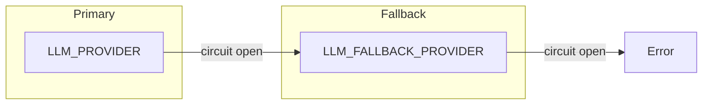

# Reference

Quick reference for configuration, errors, and terminology.

## Environment Variables

All configuration is via environment variables. Copy `.env.example` to `.env` and customize.

### Core Settings

| Variable | Default | Description |
|----------|---------|-------------|
| `APP_ENV` | development | Environment: `development` or `production` |
| `DEBUG` | false | Enable debug mode (never in production) |
| `LOG_LEVEL` | INFO | Logging level: DEBUG, INFO, WARNING, ERROR |
| `FRONTEND_URL` | http://localhost:5173 | Base URL for emails and redirects |

### LLM Provider



| Variable | Default | Description |
|----------|---------|-------------|
| `LLM_PROVIDER` | anthropic | Primary: `anthropic`, `ollama`, `mock` |
| `LLM_FALLBACK_PROVIDER` | mock | Fallback: `anthropic`, `ollama`, `mock` |
| `LLM_FALLBACK_ENABLED` | true | Enable fallback on failure |
| `USE_MOCK_LLM` | false | Override all providers with mock |
| `LLM_USE_FEW_SHOTS` | false | Include examples in prompts |

**Anthropic:**

| Variable | Default | Description |
|----------|---------|-------------|
| `ANTHROPIC_API_KEY` | - | Required when using Anthropic |
| `ANTHROPIC_MODEL` | claude-haiku-4-5-20251001 | Model ID |
| `ANTHROPIC_MAX_TOKENS` | 2048 | Max response tokens |
| `ANTHROPIC_TIMEOUT` | 30 | Request timeout (seconds) |

**Ollama:**

| Variable | Default | Description |
|----------|---------|-------------|
| `OLLAMA_ENABLED` | true | Enable Ollama integration |
| `OLLAMA_BASE_URL` | http://localhost:11434 | Ollama server URL |
| `OLLAMA_MODEL` | qwen2.5:3b | Model name |
| `OLLAMA_TIMEOUT` | 300 | Request timeout (seconds) |
| `OLLAMA_MAX_TOKENS` | 1024 | Max response tokens |

### Database

| Variable | Default | Description |
|----------|---------|-------------|
| `DATABASE_URL` | postgresql://... | PostgreSQL connection string |
| `DB_POOL_SIZE` | 20 | Connection pool size |
| `DB_MAX_OVERFLOW` | 30 | Max overflow connections |
| `DB_POOL_TIMEOUT` | 10 | Seconds to wait for connection |

### Redis Cache

| Variable | Default | Description |
|----------|---------|-------------|
| `REDIS_URL` | - | Redis connection string |
| `REDIS_ENABLED` | true | Enable caching |

**Cache TTLs (seconds):**

| Variable | Default | Use |
|----------|---------|-----|
| `CACHE_TTL_VERSE` | 86400 | Individual verses |
| `CACHE_TTL_SEARCH` | 300 | Search results |
| `CACHE_TTL_METADATA` | 86400 | Book/chapter data |
| `CACHE_TTL_RAG_OUTPUT` | 86400 | RAG pipeline output |

### Security

| Variable | Default | Production Required |
|----------|---------|---------------------|
| `JWT_SECRET` | dev-secret... | **Yes** - generate with `secrets.token_hex(32)` |
| `API_KEY` | dev-api-key... | **Yes** - generate secure key |
| `COOKIE_SECURE` | false | **Yes** - set `true` for HTTPS |
| `CORS_ORIGINS` | localhost only | **Yes** - add your domain |

### Rate Limits

| Variable | Default | Description |
|----------|---------|-------------|
| `ANALYZE_RATE_LIMIT` | 10/hour | Case analysis requests |
| `FOLLOW_UP_RATE_LIMIT` | 30/hour | Follow-up questions |

### Circuit Breakers

| Variable | Default | Description |
|----------|---------|-------------|
| `CB_LLM_FAILURE_THRESHOLD` | 3 | Failures before circuit opens |
| `CB_LLM_RECOVERY_TIMEOUT` | 60 | Seconds before retry |
| `CB_CHROMADB_FAILURE_THRESHOLD` | 3 | Vector store failures |
| `CB_CHROMADB_RECOVERY_TIMEOUT` | 60 | Seconds before retry |
| `CB_EMAIL_FAILURE_THRESHOLD` | 5 | Email service failures |
| `CB_EMAIL_RECOVERY_TIMEOUT` | 60 | Seconds before retry |

### Email (Resend)

| Variable | Default | Description |
|----------|---------|-------------|
| `RESEND_API_KEY` | - | Resend API key |
| `CONTACT_EMAIL_TO` | - | Recipient for contact form |
| `CONTACT_EMAIL_FROM` | - | Sender (verified domain) |
| `NEWSLETTER_DRY_RUN` | true | Log emails, don't send |

### RAG Pipeline

| Variable | Default | Description |
|----------|---------|-------------|
| `RAG_TOP_K_VERSES` | 5 | Verses to retrieve |
| `RAG_TOP_M_COMMENTARIES` | 3 | Commentaries per verse |
| `RAG_CONFIDENCE_THRESHOLD` | 0.7 | Min confidence score |
| `RAG_SCHOLAR_REVIEW_THRESHOLD` | 0.6 | Flag for review below this |

---

## Error Codes

API errors return JSON with `detail` field containing the message.

### Authentication (401, 403)

| Error | Status | Cause |
|-------|--------|-------|
| `Invalid email or password` | 401 | Login failed |
| `Invalid or missing API key` | 401 | Admin endpoint without X-API-Key |
| `Invalid or expired token` | 401 | JWT expired or malformed |
| `Authentication required` | 401 | Protected endpoint without token |

### Not Found (404)

| Error | Status | Cause |
|-------|--------|-------|
| `Case not found` | 404 | Case ID doesn't exist |
| `Verse not found` | 404 | Verse reference invalid |
| `Output not found` | 404 | Output ID doesn't exist |
| `User not found` | 404 | User ID doesn't exist |

### Access Denied (403)

| Error | Status | Cause |
|-------|--------|-------|
| `You don't have access to this case` | 403 | Case belongs to another user |
| `You don't have access to this output` | 403 | Output belongs to another user |

### Rate Limiting (429)

| Error | Status | Cause |
|-------|--------|-------|
| `Rate limit exceeded` | 429 | Too many requests |

### Server Errors (500, 503)

| Error | Status | Cause |
|-------|--------|-------|
| `LLM service unavailable` | 503 | Circuit breaker open |
| `Vector store unavailable` | 503 | ChromaDB circuit open |

---

## Glossary

### Domain Terms

| Term | Definition |
|------|------------|
| **Bhagavad Geeta** | Ancient Sanskrit scripture with 701 verses across 18 chapters |
| **Verse** | Single shloka with Sanskrit text, transliteration, translations |
| **Chapter** | One of 18 chapters (adhyaya) of the Geeta |
| **Commentary** | Scholar interpretation of a verse |
| **Paraphrase** | Plain-language summary of verse meaning |

### Product Terms

| Term | Definition |
|------|------------|
| **Case** | User's ethical dilemma submitted for guidance |
| **Output** | LLM-generated analysis with options and recommendations |
| **Consultation** | Complete flow: case → analysis → follow-ups |
| **Follow-up** | Conversational question after initial analysis |
| **Featured Case** | Curated example consultation |

### Technical Terms

| Term | Definition |
|------|------------|
| **RAG** | Retrieval-Augmented Generation - grounds LLM in scripture |
| **Embedding** | 384-dim vector representation of text |
| **Circuit Breaker** | Pattern that stops calling failing services ([diagram](architecture.md#resilience-patterns)) |
| **Fallback** | Alternative path when primary fails |

---

## Operational Scripts

Located in `backend/scripts/`. Run from backend directory.

### Database

**init_db.py** - Initialize database schema
```bash
python scripts/init_db.py
```

### Data Ingestion

**ingest_data.py** - Load Geeta verses and metadata
```bash
# Dry run (preview)
python scripts/ingest_data.py --dry-run

# Full ingestion
python scripts/ingest_data.py
```

### Enrichment

**backfill_paraphrase_metadata.py** - Add paraphrase metadata to verses
```bash
python scripts/backfill_paraphrase_metadata.py
```

### Admin API

Protected endpoints require `X-API-Key` header.

| Endpoint | Method | Purpose |
|----------|--------|---------|
| `/api/v1/admin/status` | GET | System status |
| `/api/v1/admin/ingest` | POST | Trigger data ingestion |
| `/api/v1/admin/sync-featured` | POST | Sync featured cases |
| `/api/v1/admin/enrich` | POST | Enrich verse metadata |

```bash
# Example: Check status
curl -H "X-API-Key: your-api-key" http://localhost:8000/api/v1/admin/status
```

---

## See Also

- [Setup Guide](setup.md) — Development environment
- [Deployment](deployment.md) — Production configuration
- [Observability](observability.md) — Metrics and monitoring
