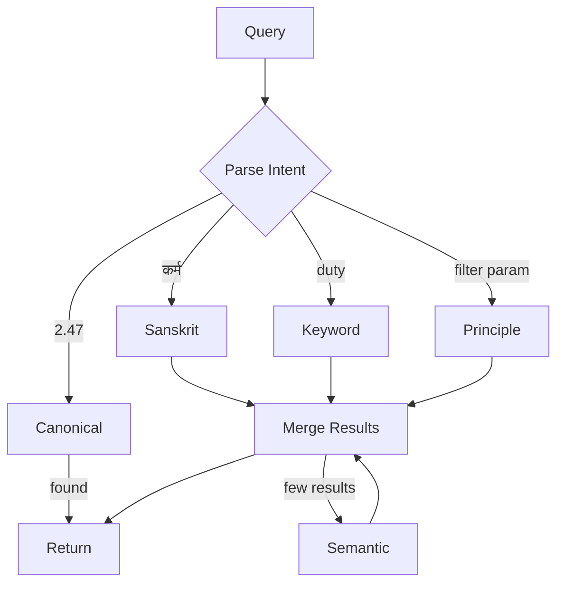

# Search

Users search in different ways. Some know the exact verse ("2.47"). Some remember a Sanskrit phrase. Others have a vague idea ("something about duty"). Geetanjali's search handles all of these — it figures out what you're looking for and finds the best matches.

## How It Works

```
┌─────────────────────────────────────────────────────────────────┐
│  User Query: "duty dharma karma"                                │
├─────────────────────────────────────────────────────────────────┤
│                                                                 │
│  1. PARSE          Is it a verse ref? Sanskrit? Situational?    │
│        ↓                                                        │
│  2. MODERATE       Check content policy (skip for safe types)   │
│        ↓                                                        │
│  3. SEARCH         Run strategies based on query type           │
│        ↓                                                        │
│  4. MERGE          Dedupe, rank, paginate                       │
│        ↓                                                        │
│  5. RESPOND        Results + match transparency + suggestions   │
│                                                                 │
└─────────────────────────────────────────────────────────────────┘
```

## Search Strategies

Five strategies, executed based on query intent:

| Strategy | Trigger | Example | Priority |
|----------|---------|---------|----------|
| **Canonical** | Verse reference pattern | `2.47`, `BG_2_47` | 1 (highest) |
| **Sanskrit** | Devanagari or IAST text | `कर्म`, `karmaṇy` | 2 |
| **Keyword** | English words | `duty`, `attachment` | 3 |
| **Principle** | Topic filter param | `?principle=detachment` | 4 |
| **Semantic** | Fallback for low results | `how to handle failure` | 5 |



### Strategy Details

**Canonical** — Direct verse lookup. Patterns: `2.47`, `2:47`, `BG_2_47`, `chapter 2 verse 47`. Returns immediately if found.

**Sanskrit** — Searches `sanskrit_devanagari` and `sanskrit_iast` fields. Detects Devanagari Unicode range (U+0900-U+097F) or IAST diacritics (āīūṛṝ...).

**Keyword** — Full-text search with hybrid OR logic. Multi-word queries match verses containing ANY keyword, ranked by match count.

**Principle** — Filters by consulting principle using PostgreSQL JSONB array contains.

**Semantic** — ChromaDB vector similarity using all-MiniLM-L6-v2 embeddings. Runs as fallback when other strategies return few results.

## Hybrid OR Search

Multi-word queries use OR logic instead of AND:

```
Query: "duty dharma karma attachment"

Traditional AND: Must contain ALL keywords (very restrictive)
Hybrid OR:       Contains ANY keyword (inclusive)

Ranking by match count:
  4/4 matches → rank_score ~1.4
  3/4 matches → rank_score ~1.3
  2/4 matches → rank_score ~1.2
  1/4 matches → rank_score ~1.1
```

### Search Priority

Keyword search checks fields in order (first match wins in deduplication):

1. `Verse.translation_en` — Primary translation (score 0.7-1.0)
2. `Translation.text` — Scholar translations (score 0.6-1.0)
3. `Verse.paraphrase_en` — Leadership paraphrase (score 0.5-0.9)

## Ranking

Results are scored using:

```python
rank_score = (
    weight_match_type * type_score      # Match type priority
  + weight_score * raw_score            # Quality within category
  + weight_match_count * match_count    # Hybrid OR bonus
  + featured_boost                      # Curated verse bonus
)
```

Default weights:

| Weight | Value | Purpose |
|--------|-------|---------|
| `weight_match_type` | 1.0 | Base priority by match type |
| `weight_score` | 0.5 | Raw match quality |
| `weight_match_count` | 0.1 | Per-keyword bonus |
| `featured_boost` | 0.15 | Curated verses |

## Content Moderation

Search uses stricter rules than consultation:

| Check | Rule | Reason |
|-------|------|--------|
| Profanity | Block ANY | Sacred text search |
| Explicit | Block always | Safety |
| Slurs | Block always | Safety |
| Gibberish | Skip ≤3 words | Allow "karma", "dharma" |
| Gibberish | Check 4+ words | Prevent spam |

```
┌─────────────────────────────────────────────────────────────────┐
│  Moderation Skip Conditions                                     │
├─────────────────────────────────────────────────────────────────┤
│  • Canonical verse references → always valid                    │
│  • Sanskrit/Devanagari text → can't apply English filters       │
│  • Short queries (≤3 words) → allow spiritual terms             │
└─────────────────────────────────────────────────────────────────┘
```

Frontend mirrors backend rules for instant feedback. Backend is authoritative.

## API

### Search Verses

```
GET /api/v1/search?q={query}&principle={tag}&limit={n}&offset={n}
```

| Param | Type | Description |
|-------|------|-------------|
| `q` | string | Search query (required) |
| `principle` | string | Filter by consulting principle |
| `limit` | int | Results per page (default: 20) |
| `offset` | int | Pagination offset |

### Response

```json
{
  "query": "duty dharma karma",
  "strategy": "keyword",
  "total": 12,
  "total_count": 45,
  "results": [
    {
      "canonical_id": "BG_2_47",
      "chapter": 2,
      "verse": 47,
      "sanskrit_devanagari": "कर्मण्येवाधिकारस्ते...",
      "translation_en": "You have the right to work only...",
      "paraphrase_en": "Focus on duty without attachment...",
      "principles": ["duty_focused_action", "non_attachment"],
      "is_featured": true,
      "match": {
        "type": "keyword_translation",
        "field": "translation_en",
        "score": 0.85,
        "highlight": "Focus on your <mark>duty</mark>...",
        "match_count": 3
      },
      "rank_score": 1.45
    }
  ],
  "moderation": null,
  "suggestion": null
}
```

### Match Transparency

Every result includes a `match` object:

- **type**: Strategy that matched (`exact_canonical`, `keyword_translation`, etc.)
- **field**: Database field containing the match
- **score**: Raw quality score (0-1)
- **highlight**: Matched text with `<mark>` tags
- **match_count**: Keywords found (for hybrid OR ranking)

### Situational Suggestions

Queries that look like personal dilemmas trigger a consultation suggestion:

```
Query: "How do I handle stress at work?"
  → Detected as situational
  → Response includes:
    suggestion: {
      type: "consultation",
      message: "Looking for guidance?...",
      cta: "Get Guidance"
    }
```

Detection patterns:
- Personal pronouns + problem words: "my team is struggling"
- Question patterns: "how do I", "what should I"
- Emotion words: "stressed", "anxious", "confused"

## Frontend

### Search Page (`/search`)

```
┌──────────────────────────────────────────────────────────────┐
│  Search the Bhagavad Geeta                                   │
│  Find verses by reference, Sanskrit, or meaning              │
├──────────────────────────────────────────────────────────────┤
│                                                              │
│  ┌────────────────────────────────────────────┬──────────┐   │
│  │ 🔍  Search verses, topics...         ⌘K    │  Search  │   │
│  └────────────────────────────────────────────┴──────────┘   │
│                                                              │
│        Try: [2.47] [कर्म] [duty]                               │
│                                                              │
│        Or explore: [Duty] [Detachment] [Self-Control]        │
│                                                              │
│  ┌────────────────────────────────────────────────────────┐  │
│  │                    ॐ                                  │  │
│  │        [Featured Verse Sanskrit]                       │  │
│  │              ॥ 2.47 ॥                                 │  │
│  │        "Leadership insight..."                         │  │
│  └────────────────────────────────────────────────────────┘  │
│                                                              │
│              Browse all 700 verses →                         │
│                                                              │
└──────────────────────────────────────────────────────────────┘
```

**Features:**

| Feature | Description |
|---------|-------------|
| Inline search button | Pill-shaped, attached to input |
| Recent searches | Dropdown on focus, keyboard navigable |
| Quick examples | Verse ref, Sanskrit, English buttons |
| Topic pills | Browse by principle |
| Featured verse | Random verse spotlight |
| Match badges | Type indicator on results |
| Highlighted text | Keywords marked in results |
| Consultation banner | For situational queries |
| Keyboard shortcut | ⌘K / Ctrl+K to focus |
| Infinite scroll | Load more with progress indicator |

### URL Sync

Query syncs with URL: `/search?q=duty` enables sharing and browser history.

## Architecture

```
backend/services/search/
├── __init__.py         # Public exports
├── service.py          # SearchService orchestrator
├── parser.py           # QueryParser (intent detection)
├── types.py            # SearchResult, SearchMatch, etc.
├── config.py           # SearchConfig (weights, limits)
├── ranking.py          # Score computation, merging
├── utils.py            # SQL escaping, highlighting
└── strategies/
    ├── canonical.py    # Exact verse lookup
    ├── sanskrit.py     # Devanagari/IAST search
    ├── keyword.py      # Hybrid OR text search
    ├── principle.py    # JSONB principle filter
    └── semantic.py     # ChromaDB vector search

frontend/src/
├── pages/Search.tsx    # Search page component
├── hooks/useSearch.ts  # Search state management
└── lib/contentFilter.ts # Client-side validation
```

## Performance

| Operation | Latency |
|-----------|---------|
| Canonical lookup | ~5ms |
| Keyword search | ~20ms |
| Semantic search | ~40ms |
| Full hybrid | ~60ms |

Semantic includes embedding generation (~15ms) and ChromaDB query (~25ms).
